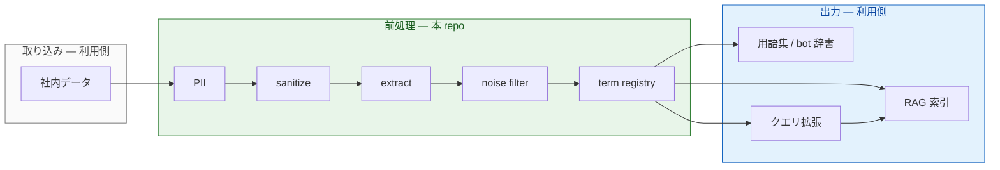
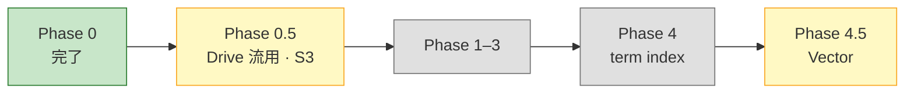
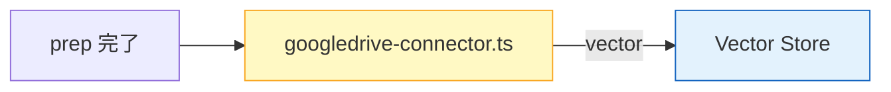

# term-prep-platform

社内文書を RAG やボット辞書に載せる**前**の共通前処理を、MCP と CLI でまとめたリポジトリです。用語抽出・ノイズ除去・PII マスク・サニタイズを、複数プロジェクトで同じ仕組みに乗せます。

**English:** MCP-based data prep for RAG — shared terminology extraction, noise filtering, and document cleanup across repos.

リポジトリ: https://github.com/wombat2006/term-prep-platform  
由来: [dopagaki-transition](https://github.com/wombat2006/dopagaki-transition) から分離（2026-06-21）

---

## 概要

このリポジトリは **Prep Platform**（前処理基盤）です。Google Drive や Markdown 原稿などの社内データを、各利用側リポジトリが取り込み、RAG 索引・用語集・ボット辞書へ渡す——その**手前**までを担当します。

具体的には、次の処理を MCP（Cursor から呼び出し）とバッチ CLI で共通化します。

1. 個人情報の検出・マスク（PII）
2. ポリシーに沿った redaction（sanitize）
3. 専門用語候補の抽出（extract）
4. 一般語とドメイン語の切り分け（noise filter）
5. 用語レジストリの整備（term registry）

**ここまでが prep（Python）の中核**です。`GLOSSARY.md` の最終採択は利用側の責務です。

**connector（提案）:** Google Drive は techdev-cursor の [`googledrive-connector.ts`](https://github.com/wombat2006/techdev-cursor/blob/master/src/services/googledrive-connector.ts) を platform へ **移管・流用**（Phase 0.5 · mirror モード）。**RAG Vector 投入**も同モジュールの vector モードで platform 共通化する案あり（Phase 4.5）— 利用側 repo ごとの再実装を減らす。

設計と骨格は揃っていますが、MCP の多くはこれから実装する段階です。いま動いているのは Phase 0 の `glossary_extractor` と設定スキーマ検証、`glossary-knowledge` MCP の stub です。

アーキテクチャ図: [docs/ARCHITECTURE.md](docs/ARCHITECTURE.md) · ロードマップ: [meta/TO-BE-PLATFORM.md](meta/TO-BE-PLATFORM.md) · **方向性・コスト見積もり:** [docs/ROADMAP-AND-COSTS.md](docs/ROADMAP-AND-COSTS.md) · **実装比較:** [docs/IMPLEMENTATION-COMPARISON.md](docs/IMPLEMENTATION-COMPARISON.md) · 実行 TODO: [meta/TODO.md](meta/TODO.md) · **consumer 向け起点:** [meta/CONSUMER_HANDOFF.md](meta/CONSUMER_HANDOFF.md)

---

## 役割分担

| | 本リポジトリ | 利用側リポジトリ |
|---|---|---|
| 例 | term-prep-platform | [techdev-cursor](https://github.com/wombat2006/techdev-cursor)、[dopagaki-transition](https://github.com/wombat2006/dopagaki-transition) |
| 持つもの | MCP · CLI · schema · **connectors（提案）** | corpus · 正典 · query expander |
| 接続 | `.cursor/mcp.json` · npm connector scripts | `glossary-config.json` |
| **進捗の読み取り** | [meta/CONSUMER_HANDOFF.md](meta/CONSUMER_HANDOFF.md) が consumer の起点 | [platform-integration](https://github.com/wombat2006/techdev-cursor/blob/master/meta/platform-integration/README.md) を platform が参照 |

本リポジトリが出力する adopt / hold JSON や（将来の）term registry を、各利用側が RAG・辞書・クエリ拡張に接続します。

---

## パイプライン



緑が本リポジトリ、青・灰が利用側です。

| 段 | 本 repo の実装 | 状態 |
|---|---|---|
| PII | [mcp/pii-guard/](mcp/pii-guard/) | 予定 |
| sanitize | [mcp/sanitize/](mcp/sanitize/) | 予定 |
| extract | [mcp/term-extract/](mcp/term-extract/) · `scripts/glossary_extractor.py` | 一部実装 |
| noise filter | [mcp/glossary-knowledge/](mcp/glossary-knowledge/) | stub |
| term registry | `scripts/glossary/registry.py` | Phase 1 以降 |
| RAG · 辞書 · クエリ拡張 | 利用側 | — |

---

## ロードマップ



| Phase | 内容 | 状態 |
|---|---|---|
| **0** | adopt/hold 分割 · JSON Schema 検証 | **完了** |
| **0.5** | corpus mirror — S3（Python）· **Drive（googledrive-connector.ts 流用）** | **提案** |
| **1–3** | Core 分離 · filter · GLOSSARY | 未着手 |
| **4** | RAG term index（Python） | 未着手 |
| **4.5** | **RAG Vector connector** — 同一 TS · vector モード | **提案** — [P-008](meta/glossary-pipeline/PROBLEMS.md#p-008) |

Phase 0.5 — Drive mirror（googledrive-connector 流用）:


Phase 4.5 — 同一 connector で Vector 投入（提案）:



チェックリスト: [meta/TODO.md](meta/TODO.md) · AS-IS / To-Be 詳細: [meta/TO-BE-PLATFORM.md](meta/TO-BE-PLATFORM.md#as-is--to-be--ingestsource-connector)

---

## 運用通知（LINE · 計画）

Phase 3+（定期 batch 運用）で、prep の成否を **LINE Business** に通知する予定です。既存のサーバ監視（`line-notification.com` · Webhook）と**同じ HTTP POST 経路**を流用するため、新規 LINE 連携のコストは低い想定です。

```text
EventBridge（prep succeeded / failed / warning）
  → Lambda prep-notify
  → 既存 Webhook URL（Secrets Manager）
  → LINE Business アカウントへ配信
```

| severity | 用途の例 |
|---|---|
| `✅ SUCCESS` | batch 正常完了 · adopt/hold 生成 |
| `⚠️ WARNING` | shard 遅延 · 閾値超過 |
| `❌ FAILED` | prep 失敗 · shard エラー |

メッセージ体裁はサーバ監視のヘルスレポートと同型（`📍` · `💬` · `📋 Details` · `🕐`）。メール（Amazon SES）は LINE で足りない場合の任意経路。

くわしく: [docs/IAC.md § LINE Webhook](docs/IAC.md#line-webhook--運用通知phase-3--第一候補) · Terraform モジュール `prep-notify`（[infra/terraform/](infra/terraform/)）

---

## 利用側リポジトリ

| リポジトリ | 用途 | 設定 |
|---|---|---|
| [techdev-cursor](https://github.com/wombat2006/techdev-cursor) | Google Drive → RAG 前処理 | [meta/CONSUMER_HANDOFF.md](meta/CONSUMER_HANDOFF.md) |
| [dopagaki-transition](https://github.com/wombat2006/dopagaki-transition) | 研究原稿の用語集 | [projects/dopagaki-transition/](projects/dopagaki-transition/) |

連携手順: [docs/integrations/](docs/integrations/)

---

## はじめ方

```bash
git clone https://github.com/wombat2006/term-prep-platform.git
cd term-prep-platform
python3.11 -m venv .venv
source .venv/bin/activate
python -m pip install -r requirements-dev.txt
python -m pip install -r mcp/glossary-knowledge/requirements.txt
python -m pip install -e .

# 形態素エンジンと設定ファイルの確認
term-prep-extract --check \
  --config projects/dopagaki-transition/glossary-config.json

# MCP stub の動作確認
cd mcp/glossary-knowledge && PYTHONPATH=. python -c "
from glossary_knowledge_mcp.server import classify_term, list_providers
print(list_providers())
r = classify_term('探索', domain='attention-economics')
assert r['label'] == 'unknown'
print('OK:', r)
"
```

**OS 依存:** MeCab（`libmecab`）。AlmaLinux では `sudo dnf install mecab` のみで足ります（`mecab-devel` は不要）。

**実行時の注意**

- 必ず `.venv` を有効化してから CLI を動かしてください。システム Python にだけパッケージを入れても、venv 実行時には反映されません。
- 依存関係は `requirements-dev.txt` 一括インストールを正とします（`jsonschema` 含む）。
- `--config` で渡す JSON は起動時に [スキーマ](meta/schemas/glossary-config.schema.json) で検証されます（`--check` も同様）。
- `project_root` は config ファイルからの相対パスです。corpus のパスもそこを基準に解決します。

くわしく: [scripts/README.md](scripts/README.md) · [meta/schemas/README.md](meta/schemas/README.md)

---

## Package contract (D-004)

Consumer は sibling path ではなく package の entrypoint を呼び出す。

```bash
term-prep-extract --check --config meta/glossary-config.json
term-prep-sync --check --config meta/glossary-config.json
term-prep-glossary-knowledge-mcp
term-prep-contract-check --config meta/glossary-config.json --expect-major 1
```

consumer 起点: [meta/CONSUMER_HANDOFF.md](meta/CONSUMER_HANDOFF.md)  
cutover guide: [meta/consumer-handoff/04-consumer-pr-guide-techdev-cursor.md](meta/consumer-handoff/04-consumer-pr-guide-techdev-cursor.md)

---

## Contract-first canon for Plan B (D-005 draft)

Remote service implementation is not started yet. Before implementation, canonical
contracts are fixed at:

- [meta/contracts/README.md](meta/contracts/README.md)
- [meta/contracts/http/openapi.yaml](meta/contracts/http/openapi.yaml)
- [meta/contracts/sse/event-envelope.schema.json](meta/contracts/sse/event-envelope.schema.json)
- [meta/contracts/mcp-tool-contract.md](meta/contracts/mcp-tool-contract.md)
- [meta/contracts/connector-spi.md](meta/contracts/connector-spi.md)

Current production path remains package CLI contract (`1.x`).

---

## ディレクトリ構成

```text
term-prep-platform/
  src/term_prep_platform/   … package entrypoints（extract/sync/mcp/contract）
  mcp/                    … MCP サーバ（1 ツール = 1 パッケージ）
  scripts/                … glossary_extractor.py
  meta/glossary-pipeline/ … 問題・手段案・採択（他 repo へ移植可）
  meta/contracts/         … Plan B contract canon（domain/surface/SPI）
  meta/schemas/           … glossary-config の JSON Schema
  meta/TODO.md             … 実行チェックリスト（Phase 0.5 含む）
  meta/TO-BE-PLATFORM.md  … ロードマップ · AS-IS / To-Be
  projects/               … 利用側ごとの config サンプル
  docs/                   … アーキテクチャ・連携ドキュメント
```

---

## MCP サーバ（現状）

パイプライン順:

| サーバ | 段 | 状態 | 主なツール |
|---|---|---|---|
| [pii-guard](mcp/pii-guard/) | PII | 予定 | — |
| [sanitize](mcp/sanitize/) | sanitize | 予定 | — |
| term-extract | extract | 予定 | — |
| [glossary-knowledge](mcp/glossary-knowledge/) | noise filter | stub | `classify_term`, `classify_batch` など |

---

## 関連ドキュメント

- [docs/ARCHITECTURE.md](docs/ARCHITECTURE.md) — 提供範囲と UML 図
- [docs/IMPLEMENTATION-COMPARISON.md](docs/IMPLEMENTATION-COMPARISON.md) — Phase · connector · AWS（EC2/EKS/ECS/SageMaker）比較
- [docs/IAC.md](docs/IAC.md) — IaC · Terraform · **LINE 運用通知** · KMS · TF vs CFN
- [meta/TO-BE-PLATFORM.md](meta/TO-BE-PLATFORM.md) — AS-IS / To-Be · ロードマップ
- [meta/TODO.md](meta/TODO.md) — 実行チェックリスト
- [meta/glossary-pipeline/PROBLEMS.md](meta/glossary-pipeline/PROBLEMS.md#p-007) — Source connector 課題
- [meta/glossary-pipeline/README.md](meta/glossary-pipeline/README.md) — governance の移植手順
- [research-log/RL-20260621-knowledge-filter-mcp.md](research-log/RL-20260621-knowledge-filter-mcp.md) — Knowledge Filter MCP 方針

---

## Topics

`mcp` · `rag` · `terminology` · `glossary` · `data-prep` · `python` · `cursor`
