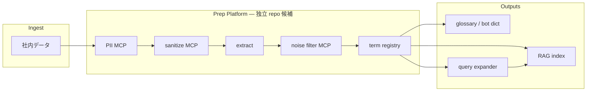

# term-prep-platform

> **社内データを RAG に載せる前の前処理 — 用語抽出・ノイズ除去・PII/サニタイズを MCP で共通化**

**English:** MCP-based data prep for RAG — terminology extraction, noise filtering, and document cleanup, shared across repos.

Repository:
https://github.com/wombat2006/term-prep-platform

Status:
Initial extract from [dopagaki-transition](https://github.com/wombat2006/dopagaki-transition) (2026-06-21)

---

## 目指すフロー

**社内データ → 前処理（本 repo）→ 用語レジストリ → RAG / 辞書 / クエリ拡張** を一貫させる。**Prep Platform として独立 repo 化する候補** — consumer PRJ は corpus・正典・RAG 索引を持ち、前処理ロジックはここに集約する。



| ステージ | 本 repo の対応 | 状態 |
|---|---|---|
| PII MCP | [mcp/pii-guard/](mcp/pii-guard/) | planned |
| sanitize MCP | [mcp/sanitize/](mcp/sanitize/) | planned |
| extract | [mcp/term-extract/](mcp/term-extract/) · `scripts/glossary_extractor.py` | planned / 部分実装 |
| noise filter MCP | [mcp/glossary-knowledge/](mcp/glossary-knowledge/) | stub |
| term registry | `scripts/glossary/registry.py`（Phase 1 以降） | planned |
| RAG index · glossary · query expander | 各 consumer PRJ（例: [techdev-cursor](projects/techdev-cursor/)） | consumer 側 |

詳細: [docs/ARCHITECTURE.md](docs/ARCHITECTURE.md) · [meta/TO-BE-PLATFORM.md](meta/TO-BE-PLATFORM.md)

---

## 何をする repo か

| 層 | 本 repo | 各 consumer PRJ |
|---|---|---|
| MCP servers（Python, stdio） | ✅ | `.cursor/mcp.json` で参照 |
| 抽出 CLI・governance テンプレ | ✅ | — |
| corpus・正典・GLOSSARY | — | ✅ |

**第 1 consumer:** [techdev-cursor](https://github.com/wombat2006/techdev-cursor) — Google Drive → RAG 前処理  
**参考 consumer:** [dopagaki-transition](https://github.com/wombat2006/dopagaki-transition) — 研究原稿用語集

---

## クイックスタート

```bash
git clone https://github.com/wombat2006/term-prep-platform.git
cd term-prep-platform
python3.11 -m venv .venv
source .venv/bin/activate
python -m pip install -r requirements-dev.txt
python -m pip install -r mcp/glossary-knowledge/requirements.txt

# 形態素バックエンド確認
python scripts/glossary_extractor.py --check --config projects/dopagaki-transition/glossary-config.json

# MCP provider stub（pip 不要の部分）
cd mcp/glossary-knowledge && PYTHONPATH=. python -c "
from glossary_knowledge_mcp.server import classify_term, list_providers
print(list_providers())
r = classify_term('探索', domain='attention-economics')
assert r['label'] == 'unknown'
print('OK:', r)
"
```

**System:** MeCab (`libmecab`) — AlmaLinux: `sudo dnf install mecab` only

### 注意点（Python / config）

| 項目 | 内容 |
|---|---|
| **venv を使う** | クイックスタートどおり `.venv` を作り `source .venv/bin/activate` してから実行する。システムの `python3 -m pip install jsonschema` だけでは、別インタプリタで CLI を動かしたときに依存が見つからないことがある |
| **依存の入れ方** | `requirements-dev.txt` 一括インストールを正とする（`jsonschema>=4.23.0` 含む）。個別 pip は dev 環境の再現性を崩しやすい |
| **config 検証** | すべての実行で [meta/schemas/glossary-config.schema.json](meta/schemas/glossary-config.schema.json) を検証。**`--check` も対象** |
| **Phase 0 config** | `filter` / `output`（adopt+hold オブジェクト）/ `knowledge_filter` を推奨。テンプレ: [projects/_template/](projects/_template/) |
| **exit code** | `0` 成功 · `1` config/IO/**スキーマ不一致** · `2` fugashi / 辞書不可 |
| **project_root** | config ファイル位置からの相対パス。corpus パスは `project_root` 基準 |

詳細: [meta/schemas/README.md](meta/schemas/README.md) · [scripts/README.md](scripts/README.md)

---

## ディレクトリ

```text
term-prep-platform/
  mcp/                    … MCP servers（1 tool = 1 package）
  scripts/                … glossary_extractor.py
  meta/glossary-pipeline/ … 問題・手段案・採択（portable）
  meta/schemas/           … glossary-config JSON Schema
  meta/TO-BE-PLATFORM.md  … ロードマップ
  projects/               … consumer 別 config サンプル
  docs/                   … アーキテクチャ・連携
```

---

## MCP（現状）

パイプライン順（[目指すフロー](#目指すフロー)）:

| Server | Flow stage | Status | Tools |
|---|---|---|---|
| [pii-guard](mcp/pii-guard/) | PII | planned | — |
| [sanitize](mcp/sanitize/) | sanitize | planned | — |
| term-extract | extract | planned | — |
| [glossary-knowledge](mcp/glossary-knowledge/) | noise filter | **stub** (NullProvider) | `classify_term`, `classify_batch`, … |

---

## Consumer 設定

| PRJ | Config |
|---|---|
| dopagaki-transition | [projects/dopagaki-transition/](projects/dopagaki-transition/) |
| techdev-cursor | [projects/techdev-cursor/](projects/techdev-cursor/) |

詳細: [docs/integrations/](docs/integrations/)

---

## 関連

- [meta/schemas/README.md](meta/schemas/README.md) — config スキーマ・検証の注意点
- [meta/glossary-pipeline/README.md](meta/glossary-pipeline/README.md) — 移植・ governance
- [research-log/RL-20260621-knowledge-filter-mcp.md](research-log/RL-20260621-knowledge-filter-mcp.md) — MCP 方針（closed）
- Origin: dopagaki-transition @ `5306a8b`

---

## Topics

`mcp` · `rag` · `terminology` · `glossary` · `data-prep` · `python` · `cursor`
