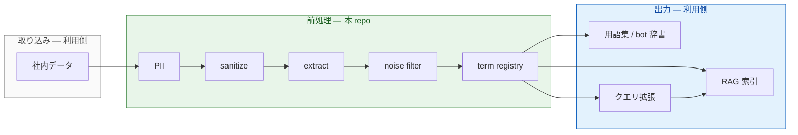

# term-prep-platform

社内文書を RAG やボット辞書に載せる**前**の共通前処理を、MCP と CLI でまとめたリポジトリです。用語抽出・ノイズ除去・PII マスク・サニタイズを、複数プロジェクトで同じ仕組みに乗せます。

**English:** MCP-based data prep for RAG — shared terminology extraction, noise filtering, and document cleanup across repos.

リポジトリ: https://github.com/wombat2006/term-prep-platform  
由来: [dopagaki-transition](https://github.com/wombat2006/dopagaki-transition) から分離（2026-06-21）

---

## 概要

このリポジトリは **Prep Platform**（前処理基盤）です。Google Drive や Markdown 原稿などの社内データを、各利用側リポジトリが取り込み、RAG 索引・用語集・ボット辞書へ渡す——その**手前**までを担当します。

具体的には、次の処理を MCP（Cursor から呼び出し）とバッチ CLI で共通化します。

1. 個人情報の検出・マスク（PII）
2. ポリシーに沿った redaction（sanitize）
3. 専門用語候補の抽出（extract）
4. 一般語とドメイン語の切り分け（noise filter）
5. 用語レジストリの整備（term registry）

**ここまでが本リポジトリの範囲**です。embedding、Vector Store、chunk 索引、`GLOSSARY.md` の最終採択、Drive 連携アプリ本体は、利用側リポジトリ側の責務です。

設計と骨格は揃っていますが、MCP の多くはこれから実装する段階です。いま動いているのは Phase 0 の `glossary_extractor` と設定スキーマ検証、`glossary-knowledge` MCP の stub です。

アーキテクチャ図（Component / Sequence など）: [docs/ARCHITECTURE.md](docs/ARCHITECTURE.md)

---

## 役割分担

| | 本リポジトリ | 利用側リポジトリ |
|---|---|---|
| 例 | term-prep-platform | [techdev-cursor](https://github.com/wombat2006/techdev-cursor)、[dopagaki-transition](https://github.com/wombat2006/dopagaki-transition) |
| 持つもの | MCP サーバ、抽出 CLI、設定スキーマ、governance テンプレ | corpus、正典、RAG 索引、ingest アプリ |
| 接続 | `.cursor/mcp.json` から参照される | `projects/*/glossary-config.json` で設定を差し替え |

本リポジトリが出力する adopt / hold JSON や（将来の）term registry を、各利用側が RAG・辞書・クエリ拡張に接続します。

---

## パイプライン



緑が本リポジトリ、青・灰が利用側です。

| 段 | 本 repo の実装 | 状態 |
|---|---|---|
| PII | [mcp/pii-guard/](mcp/pii-guard/) | 予定 |
| sanitize | [mcp/sanitize/](mcp/sanitize/) | 予定 |
| extract | [mcp/term-extract/](mcp/term-extract/) · `scripts/glossary_extractor.py` | 一部実装 |
| noise filter | [mcp/glossary-knowledge/](mcp/glossary-knowledge/) | stub |
| term registry | `scripts/glossary/registry.py` | Phase 1 以降 |
| RAG · 辞書 · クエリ拡張 | 利用側 | — |

---

## 利用側リポジトリ

| リポジトリ | 用途 | 設定 |
|---|---|---|
| [techdev-cursor](https://github.com/wombat2006/techdev-cursor) | Google Drive → RAG 前処理 | [projects/techdev-cursor/](projects/techdev-cursor/) |
| [dopagaki-transition](https://github.com/wombat2006/dopagaki-transition) | 研究原稿の用語集 | [projects/dopagaki-transition/](projects/dopagaki-transition/) |

連携手順: [docs/integrations/](docs/integrations/)

---

## はじめ方

```bash
git clone https://github.com/wombat2006/term-prep-platform.git
cd term-prep-platform
python3.11 -m venv .venv
source .venv/bin/activate
python -m pip install -r requirements-dev.txt
python -m pip install -r mcp/glossary-knowledge/requirements.txt

# 形態素エンジンと設定ファイルの確認
python scripts/glossary_extractor.py --check \
  --config projects/dopagaki-transition/glossary-config.json

# MCP stub の動作確認
cd mcp/glossary-knowledge && PYTHONPATH=. python -c "
from glossary_knowledge_mcp.server import classify_term, list_providers
print(list_providers())
r = classify_term('探索', domain='attention-economics')
assert r['label'] == 'unknown'
print('OK:', r)
"
```

**OS 依存:** MeCab（`libmecab`）。AlmaLinux では `sudo dnf install mecab` のみで足ります（`mecab-devel` は不要）。

**実行時の注意**

- 必ず `.venv` を有効化してから CLI を動かしてください。システム Python にだけパッケージを入れても、venv 実行時には反映されません。
- 依存関係は `requirements-dev.txt` 一括インストールを正とします（`jsonschema` 含む）。
- `--config` で渡す JSON は起動時に [スキーマ](meta/schemas/glossary-config.schema.json) で検証されます（`--check` も同様）。
- `project_root` は config ファイルからの相対パスです。corpus のパスもそこを基準に解決します。

くわしく: [scripts/README.md](scripts/README.md) · [meta/schemas/README.md](meta/schemas/README.md)

---

## ディレクトリ構成

```text
term-prep-platform/
  mcp/                    … MCP サーバ（1 ツール = 1 パッケージ）
  scripts/                … glossary_extractor.py
  meta/glossary-pipeline/ … 問題・手段案・採択（他 repo へ移植可）
  meta/schemas/           … glossary-config の JSON Schema
  meta/TO-BE-PLATFORM.md  … ロードマップ
  projects/               … 利用側ごとの config サンプル
  docs/                   … アーキテクチャ・連携ドキュメント
```

---

## MCP サーバ（現状）

パイプライン順:

| サーバ | 段 | 状態 | 主なツール |
|---|---|---|---|
| [pii-guard](mcp/pii-guard/) | PII | 予定 | — |
| [sanitize](mcp/sanitize/) | sanitize | 予定 | — |
| term-extract | extract | 予定 | — |
| [glossary-knowledge](mcp/glossary-knowledge/) | noise filter | stub | `classify_term`, `classify_batch` など |

---

## 関連ドキュメント

- [docs/ARCHITECTURE.md](docs/ARCHITECTURE.md) — 提供範囲と UML 図
- [meta/TO-BE-PLATFORM.md](meta/TO-BE-PLATFORM.md) — 技術ロードマップ
- [meta/glossary-pipeline/README.md](meta/glossary-pipeline/README.md) — governance の移植手順
- [research-log/RL-20260621-knowledge-filter-mcp.md](research-log/RL-20260621-knowledge-filter-mcp.md) — Knowledge Filter MCP 方針

---

## Topics

`mcp` · `rag` · `terminology` · `glossary` · `data-prep` · `python` · `cursor`
