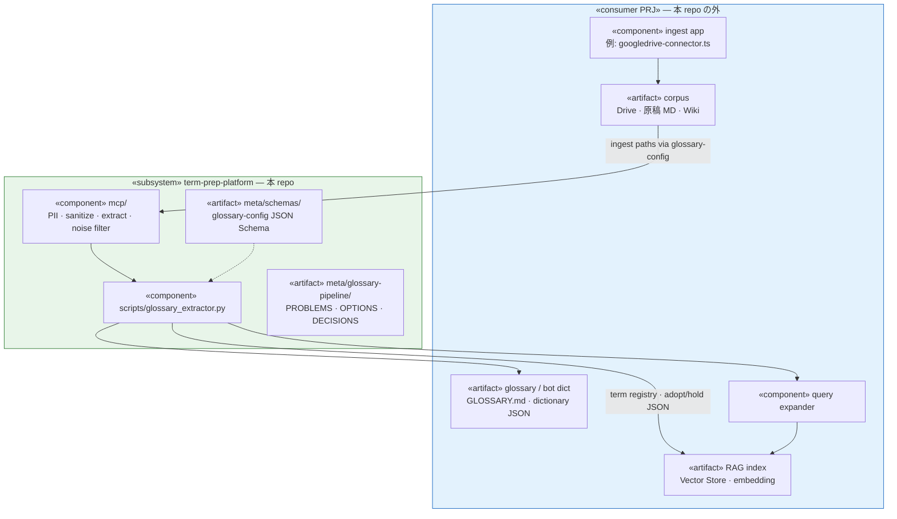
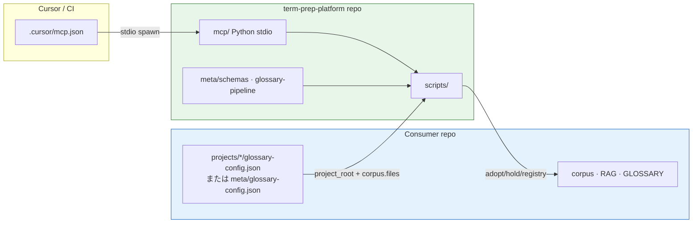
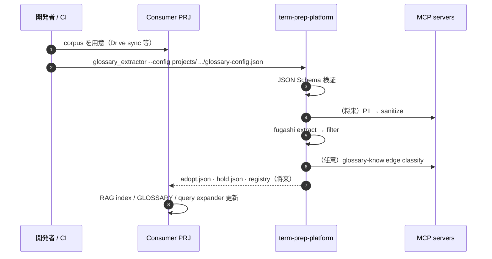
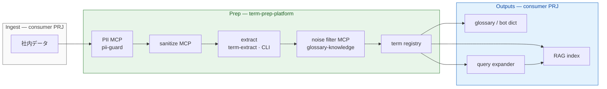

# Architecture

## Scope — この PRJ が提供するもの

**Prep Platform（独立 repo 候補）** として、社内データを RAG / 辞書に載せる**前**の共通前処理を担う。

| | 本 repo（term-prep-platform） | consumer PRJ |
|---|---|---|
| **役割** | prep — PII · sanitize · extract · filter · registry | ingest · RAG · 正典 · query expander |
| **具体例** | MCP サーバ、`glossary_extractor`、config schema、governance | corpus パス、Drive 連携、`GLOSSARY.md`、Vector Store |
| **接続** | consumer が `.cursor/mcp.json` と `projects/*/glossary-config.json` で参照 | platform 成果物（registry · adopt/hold）を受け取る |

**提供しない:** embedding、chunk 索引、人間採択の正典、ingest アプリ本体。

**成熟度:** 設計・骨格は揃った scaffold。Phase 0（extractor + schema）は動作中。多くの MCP は planned / stub。

---

## Component diagram（UML — 提供範囲）



---

## Deployment view（UML — 配置）



**Polyglot:** TypeScript consumer（techdev-cursor）は Drive / RAG コードを保持。prep は MCP stdio で platform を呼ぶ — `techsapo-providers` と同型。

---

## Sequence（UML — 典型フロー）



---

## Target flow (end-to-end)

データが流れる順。緑 = platform · 青 / 灰 = consumer。



| ノード | 役割 | 所在 |
|---|---|---|
| 社内データ | Drive export・原稿 MD・社内 Wiki 等 | consumer |
| PII MCP | 個人情報の検出・マスク・フラグ | `mcp/pii-guard/` |
| sanitize MCP | ポリシーに基づく redaction | `mcp/sanitize/` |
| extract | 形態素・候補語の抽出 | `mcp/term-extract/` · `scripts/glossary_extractor.py` |
| noise filter MCP | general / domain / unknown 分類 | `mcp/glossary-knowledge/` |
| term registry | TS / ADR / GLOSSARY 由来の閉世界 seed | `scripts/glossary/registry.py`（planned） |
| RAG index | embedding・chunk 索引 | consumer（例: techdev-cursor） |
| glossary / bot dict | 人間向け用語集・ボット辞書 JSON | consumer |
| query expander | 検索クエリの用語展開 | consumer（registry を参照） |

**query expander → RAG:** 展開されたクエリで RAG 検索精度を上げる（consumer 側の検索レイヤ）。

---

## Package map（repo 内）

```text
term-prep-platform/          ← Prep Platform（本 repo）
  mcp/                       … stdio MCP: PII → sanitize → extract → noise filter
  scripts/                   … glossary_extractor CLI · term registry（将来）
  meta/schemas/              … config 検証
  meta/glossary-pipeline/    … governance テンプレ
  projects/                  … consumer 別 config サンプル（mirror）

consumer repos/              ← 本 repo の外
  corpus · GLOSSARY · RAG · Drive 連携 · query expander
  .cursor/mcp.json           … platform MCP への参照
```

---

## Implementation status

| Stage | 提供物 | Status |
|---|---|---|
| PII MCP | `mcp/pii-guard/` | planned |
| sanitize MCP | `mcp/sanitize/` | planned |
| extract | `glossary_extractor` CLI · `mcp/term-extract/` | CLI 部分実装 / MCP planned |
| noise filter MCP | `mcp/glossary-knowledge/` | stub |
| term registry | `scripts/glossary/registry.py` | Phase 1 planned |
| config schema | `meta/schemas/` | **done** |
| Outputs | RAG · glossary · query expander | **consumer 側** |

---

## Dev / config 注意点

| 項目 | 内容 |
|---|---|
| Python 環境 | repo ルート `.venv` + `requirements-dev.txt`（`jsonschema` 含む）。システム Python への ad-hoc pip だけでは CLI/MCP で依存不一致になりうる |
| Config 検証 | `projects/*/glossary-config.json` は [meta/schemas/glossary-config.schema.json](../meta/schemas/glossary-config.schema.json) で起動時検証（`--check` 含む） |
| Config 編集 | 形式変更時は schema → テンプレ → consumer config の順で揃える |
| 詳細 | [meta/schemas/README.md](../meta/schemas/README.md) · [scripts/README.md](../scripts/README.md) |

---

## Reuse rules

| Share in platform | Keep in consumer |
|---|---|
| MCP tools & adapters | corpus paths |
| extractor CLI | human glossary / dictionary JSON |
| PROBLEMS/OPTIONS/DECISIONS template | ADR/TS/manuscript |
| config schema & templates | RAG index · Vector Store |
| prep pipeline logic | ingest app · query expander |

---

## References

- [README.md](../README.md) — 提供範囲サマリ
- [meta/schemas/README.md](../meta/schemas/README.md) — config schema・検証注意点
- [techdev-cursor integration](integrations/techdev-cursor.md)
- [dopagaki-transition integration](integrations/dopagaki-transition.md)
- [TO-BE-PLATFORM.md](../meta/TO-BE-PLATFORM.md)
