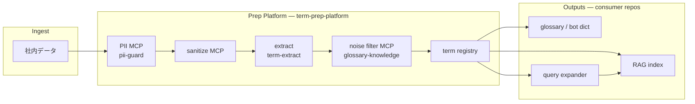

# Architecture

## Target flow (end-to-end)

本 repo は **Prep Platform（独立 repo 候補）** として、社内データの RAG 載せ前処理を担う。入口の社内データと出口の RAG / 辞書 / クエリ拡張は **consumer PRJ** が保持する。



| ノード | 役割 | 所在 |
|---|---|---|
| 社内データ | Drive export・原稿 MD・社内 Wiki 等 | consumer |
| PII MCP | 個人情報の検出・マスク・フラグ | `mcp/pii-guard/` |
| sanitize MCP | ポリシーに基づく redaction | `mcp/sanitize/` |
| extract | 形態素・候補語の抽出 | `mcp/term-extract/` · `scripts/glossary/` |
| noise filter MCP | general / domain / unknown 分類 | `mcp/glossary-knowledge/` |
| term registry | TS / ADR / GLOSSARY 由来の閉世界 seed | `scripts/glossary/registry.py` |
| RAG index | embedding・chunk 索引 | consumer（例: techdev-cursor） |
| glossary / bot dict | 人間向け用語集・ボット辞書 JSON | consumer |
| query expander | 検索クエリの用語展開 | consumer（registry を参照） |

**query expander → RAG:** 展開されたクエリで RAG 検索精度を上げる（consumer 側の検索レイヤ）。

---

## Model

```text
Consumer repos (dopagaki, techdev-cursor, …)
    │  corpus · GLOSSARY · RAG index · query expander
    │  projects/<name>/glossary-config.json
    │  .cursor/mcp.json → term-prep-platform MCPs
    ▼
term-prep-platform  （Prep Platform — 独立 repo 候補）
    mcp/           … stdio servers (Python): PII → sanitize → extract → noise filter
    scripts/       … batch CLI · term registry
    meta/          … governance + TO-BE
```

**Polyglot:** TypeScript consumers (techdev-cursor) keep Drive/RAG code; prep runs via MCP stdio — same pattern as `techsapo-providers`.

---

## Implementation status

| Stage | Status |
|---|---|
| PII MCP | planned |
| sanitize MCP | planned |
| extract | `glossary_extractor` CLI（部分）· term-extract MCP planned |
| noise filter MCP | `glossary-knowledge` stub |
| term registry | Phase 1（`scripts/glossary/` 分離予定） |
| Outputs | consumer 側 — registry 成果物を受け取る |

---

## Dev / config 注意点

| 項目 | 内容 |
|---|---|
| Python 環境 | repo ルート `.venv` + `requirements-dev.txt`（`jsonschema` 含む）。システム Python への ad-hoc pip だけでは CLI/MCP で依存不一致になりうる |
| Config 検証 | `projects/*/glossary-config.json` は [meta/schemas/glossary-config.schema.json](../meta/schemas/glossary-config.schema.json) で起動時検証（`--check` 含む） |
| Config 編集 | 形式変更時は schema → テンプレ → consumer config の順で揃える |
| 詳細 | [meta/schemas/README.md](../meta/schemas/README.md) · [scripts/README.md](../scripts/README.md) |

---

## Reuse rules

| Share in platform | Keep in consumer |
|---|---|
| MCP tools & adapters | corpus paths |
| extractor CLI | human glossary / dictionary JSON |
| PROBLEMS/OPTIONS/DECISIONS template | ADR/TS/manuscript |

---

## References

- [meta/schemas/README.md](../meta/schemas/README.md) — config schema・検証注意点
- [techdev-cursor integration](integrations/techdev-cursor.md)
- [dopagaki-transition integration](integrations/dopagaki-transition.md)
- [TO-BE-PLATFORM.md](../meta/TO-BE-PLATFORM.md)
