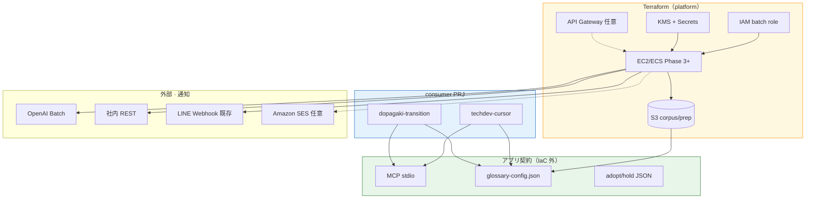

# Infrastructure as Code — 議論まとめと Terraform 方針

Status:
**採択済み（計画）** — 2026-06-21。`.tf` 実装は Phase 0.5 から段階投入。

Related:
[ROADMAP-AND-COSTS.md](ROADMAP-AND-COSTS.md) · [IMPLEMENTATION-COMPARISON.md](IMPLEMENTATION-COMPARISON.md) · [DECISIONS.md § D-003](../meta/glossary-pipeline/DECISIONS.md#d-003) · [infra/terraform/README.md](../infra/terraform/README.md)

---

## 議論サマリ（TL;DR）

| 論点 | 結論 |
|---|---|
| **IaC は要るか** | batch · S3 mirror が始まる Phase 0.5 以降は **あるとよい**。Phase 0（ローカル CLI のみ）では不要 |
| **ツール** | **Terraform**（D-003）— CloudFormation · CDK · Pulumi は棄却 |
| **consumer PRJ 接続** | **infra 境界**（S3 · IAM · secret）で効く。**MCP / glossary-config / GLOSSARY** は IaC 外 |
| **外部 API 接続** | API クライアントコードの代わりではない。**Secrets · KMS · egress · batch 実行環境**で効く |
| **KMS** | **採用推奨** — S3 暗号化 · Secrets Manager とセット |
| **API Gateway** | **条件付き** — platform を HTTP で公開するときのみ。outbound batch 中心なら後回し |
| **LINE Webhook** | **◎ 第一候補** — 既存 LINE Business 通知基盤へ POST（Phase 3+） |
| **SES** | **△ 任意** — メール必須のレビュー担当向け（LINE で足りる間は後回し） |
| **CloudFormation** | **不採用** — Terraform と役割重複 · CF 経路を CFN で書けない |

---

## 1. IaC を採用するメリットとタイミング

### メリット（本 repo 文脈）

| メリット | 内容 |
|---|---|
| **再現性** | S3 `corpus/` · `prep/` · IAM · batch compute を run ごとに同じ形で再構築 |
| **レビュー** | `terraform plan` で infra diff を PR レビュー — ARCHITECTURE と実装のズレ検知 |
| **consumer 分離** | `var.consumer_id` で S3 プレフィックス · IAM · KMS をテナント単位に増やせる |
| **セキュリティ** | 最小権限 IAM · KMS 暗号化をコードで固定。認証情報を Job に埋め込まない |
| **compute 比較** | EC2 / ECS モジュール差し替えで [IMPLEMENTATION-COMPARISON](IMPLEMENTATION-COMPARISON.md) の PoC がしやすい |

### メリットが薄い場面

| 状況 | 理由 |
|---|---|
| Phase 0 · ローカル CLI のみ | infra がまだない |
| 月 1 回 · 単発 EC2 · 初回 PoC | 手動 1 台の方が速い |
| dopagaki 型（ローカル MD のみ） | S3 / batch infra 自体が不要 |
| MCP 対話（`classify_term`） | 開発者 PC · stdio — IaC 対象外 |

### 採用タイミング

```text
いま（Phase 0）           → IaC 不要
Phase 0.5 S3 mirror 着地  → Terraform: S3 + IAM + KMS（推奨）
初回 batch PoC            → EC2 は手動可
2 回目以降の batch        → EC2 launch template を Terraform 化
prep-batch Docker 化後    → ECS module 追加
定期 ingest + 外部 API    → Secrets Manager + batch role を Terraform 化
```

---

## 2. 採択 — Terraform

| 項目 | 内容 |
|---|---|
| **IaC ツール** | **[Terraform](https://www.terraform.io/)**（HCL） |
| **対象クラウド** | **AWS 第一** · **Cloudflare は Phase 3+ ops で検討**（`cloudflare` provider） |
| **配置** | `infra/terraform/` |
| **state** | リモート backend（S3 + DynamoDB lock） |

**棄却（当面）:** AWS CloudFormation · AWS CDK · Pulumi · 手動コンソールのみ（本番 S3/IAM）

| 理由 | prep platform への当てはめ |
|---|---|
| マルチクラウド | AWS + Cloudflare を **1 言語**で書ける（CFN は AWS のみ） |
| plan/apply | corpus バケット · IAM の diff を PR レビュー |
| モジュール再利用 | consumer ごとに `consumer_id` 変数で分離 |
| 事例・Registry | batch infra（Spot · task role）の参照が多い |

---

## 3. consumer PRJ との接続

techdev-cursor · dopagaki-transition など **外部 repo** との接続は **2 層**に分かれる。

### 層 A — infra 契約（IaC が効く）

| 接続 | platform（Terraform） | consumer が持つもの |
|---|---|---|
| corpus mirror | S3 `corpus/{consumer}/` | `glossary-config` `source` 節 · integration doc |
| prep 出力 | S3 `prep/{consumer}/` | 同上 |
| batch 実行権 | IAM role ARN | assume する task / instance |
| 秘密情報 | Secrets Manager path（KMS 暗号化） | 実行時に read（値は Terraform に書かない） |

```text
platform Terraform
  └─ output（bucket · prefix · role ARN）
       └─ consumer glossary-config.json / integrations/*.md
```

consumer 側に Terraform は **基本不要**。platform が共有 infra を出し、consumer は config で参照する。

### 層 B — アプリ契約（IaC 外）

| 接続 | 担当 |
|---|---|
| MCP stdio | `.cursor/mcp.json` — ローカルパス |
| config schema | `glossary-config.json` — JSON Schema 検証 |
| adopt / hold JSON | Git 上のファイルパス |
| Drive OAuth | consumer / env — Google Console |
| GLOSSARY 人手反映 | dopagaki 等 — 編集フロー |

### consumer タイプ別

| タイプ | 例 | IaC の効き |
|---|---|---|
| Drive + S3 + batch | techdev-cursor | **◎** S3 · IAM · secret |
| ローカル MD のみ | dopagaki-transition | **✗** infra 接続なし |

---

## 4. 外部 API との接続

任意の外部 API（OpenAI Batch · 社内 REST · Confluence 等）を batch から呼ぶ場合。

### 2 層に分ける

| 層 | 内容 | 担当 |
|---|---|---|
| **接続契約** | エンドポイント · 認証 · リトライ · レート制限 | MCP provider adapter · アプリコード |
| **接続基盤** | secret 保管 · 暗号化 · egress · 実行 identity | **Terraform** |

IaC は **API の呼び方**ではなく **安全に呼ぶための周辺**を担う。

### 外部 API 種別 × IaC

| API の種類 | IaC の効き | 備考 |
|---|---|---|
| OpenAI Batch（embed） | ○ | Secrets Manager + IAM + batch role |
| LINE Webhook（通知） | ◎ | Webhook URL in Secrets · Lambda POST · **既存サーバと同型** |
| 社内 REST（用語 DB） | ◎ | 固定 IP 要求なら NAT+EIP も Terraform |
| Confluence API | ○ | connector 実装は別 · secret は IaC |
| GLiNER（HF モデル DL） | △ | 初回 DL はコンテナイメージ固定の方が楽 |
| Drive OAuth | ✗ | Google Console · consumer env |
| MCP 対話 | ✗ | ローカル |

### Terraform で書くもの（外部 API あり）

```text
Secrets Manager（リソースのみ · 値は手動/CI 注入）
  → KMS CMK で暗号化
  → IAM: prep-batch role が「この consumer の secret のみ」read
  → ECS task / EC2 instance profile に role 付与
```

---

## 5. AWS サービス選定 — KMS · 通知 · API Gateway · CloudFormation

| サービス | 採用 | 本 PRJ での役割 |
|---|---|---|
| **KMS** | **◎ 推奨** | S3 SSE-KMS · Secrets Manager 暗号化 · consumer 別 CMK |
| **Secrets Manager** | **◎ 推奨** | 外部 API key · **LINE Webhook URL**（値は Terraform 外） |
| **LINE Webhook** | **◎ 第一候補** | prep batch · 運用アラート — **既存サーバ監視と同経路** |
| **API Gateway** | **△ 条件付き** | consumer が HTTP で prep をトリガーする場合のみ |
| **SES** | **△ 任意** | メール必須のレビュー依頼 · LINE で足りない場合のみ |
| **CloudFormation** | **✗ 不採用** | Terraform と重複 · CF 経路非対応 — [§7](#7-terraform-vs-cloudformation-検証) |

### KMS — Phase 0.5 から入れる価値あり

- S3 corpus / prep の暗号化（org ポリシーで必須になりがち）
- API key を **KMS で暗号化した Secrets Manager** に格納
- IAM + KMS key policy で consumer 単位の分離

### API Gateway — 後回しでよい条件

現設計は **batch が外向きに API を叩く**形が主。以下が出たら検討:

- `POST /prep/run` で batch 起動（consumer / CI から）
- Drive Webhook 受信
- prep ステータス照会 API

```text
consumer → API Gateway → Lambda/ECS → batch job
```

MCP stdio · ローカル CLI には不要。

### LINE Webhook — 運用通知（Phase 3+ · **第一候補**）

**既存資産:** サーバ監視から **LINE Business アカウント**へ Webhook 通知する基盤が稼働済み（例: `line-notification.com` · nginx · line-webhook）。prep platform も **同じ HTTP POST パターン**で実装できる — 新規 LINE 連携の設計コストが低い。

```text
EventBridge（prep succeeded/failed/warning）
  → Lambda prep-notify
  → POST 既存 Webhook URL（Secrets Manager に格納）
  → LINE Business へ配信
```

**Terraform で書くもの（platform 側）**

| リソース | 内容 |
|---|---|
| Secrets Manager | Webhook URL **リソース**（値は手動登録） |
| IAM | Lambda notify role · `secretsmanager:GetSecretValue` + egress HTTPS |
| Lambda + EventBridge | prep イベント → Webhook POST |
| （LINE サーバ本体） | **Terraform 対象外** — 既存運用のまま |

**メッセージ形式（既存サーバ監視と同型）**

prep batch 完了（SUCCESS 相当）:

```text
✅ SUCCESS

📍 Job: prep-batch / techdev-cursor
💬 Periodic prep report: ✅ Completed

📋 Details:
📂 S3: s3://…/prep/techdev-cursor/
📊 adopt: 42 · hold: 128 · shards: 4/4

🕐 2026/6/21 22:33:24
```

閾値超過・異常（WARNING / FAILED 相当）:

```text
⚠️ WARNING

📍 Job: prep-batch / techdev-cursor
💬 GLiNER shard slow: 2/4 pending

📋 Details:
Threshold: 30 min
Elapsed: 47 min
Shard: 3/4

🕐 2026/6/21 22:33:24
```

```text
❌ FAILED

📍 Job: prep-batch / techdev-cursor
💬 Presidio shard failed: exit 1

📋 Details:
Shard: 2/4
S3 log: s3://…/prep/logs/shard-2.log

🕐 2026/6/21 22:33:24
```

**サーバ監視との統一**

| 既存（サーバ監視） | prep platform（計画） |
|---|---|
| `✅ SUCCESS` / `⚠️ WARNING` | 同じ severity プレフィックス |
| `📍 Server: hostname (IP / region)` | `📍 Job: prep-batch / {consumer}` |
| `💬` 一行サマリ | prep 段階の要約 |
| `📋 Details:` ブロック | S3 パス · メトリクス · shard 状態 |
| `🕐` タイムスタンプ | 同上 |

**用途**

| 用途 | severity |
|---|---|
| batch 正常完了 | ✅ SUCCESS |
| shard 遅延 · リトライ | ⚠️ WARNING |
| prep 失敗 · PII エラー | ❌ FAILED |
| adopt/hold 生成完了（レビュー促し） | ✅ SUCCESS + Details に件数 |

### SES — メール通知（Phase 3+ · 任意）

**LINE で運用通知が足りる間は後回し。** 社外メール · 非エンジニアレビュー担当向けにのみ検討。

| 用途 | 例 |
|---|---|
| レビュー依頼（メール派） | adopt/hold 生成後 · 担当者へリンク付き |
| 社外共有 | LINE 非利用のステークホルダー |

**Terraform で書くもの**（SES を使う場合のみ）

| リソース | 内容 |
|---|---|
| `aws_ses_domain_identity` / DKIM | 送信ドメイン検証 |
| IAM | `ses:SendEmail` 最小権限 |

**注意:** 新規アカウントは SES **サンドボックス** — production access 申請が要る。LINE 経路があるため優先度は低い。

```text
EventBridge → Lambda → SES（任意 · メール必須時のみ）
```

### CloudFormation — 使わない理由

- D-003 で **Terraform を正**とした
- 同一リソースの **二重管理を避ける**
- CDK は CFN へコンパイルされる別系統 — 本 repo では採用しない

**例外:** org の CFN StackSets で VPC 等の baseline がある場合、その**上に** Terraform で S3/IAM のみ追加するハイブリッドは可。

---

## 6. スコープ — Terraform で何を書くか

### Phase 0.5（最初の Terraform）

| リソース | 目的 |
|---|---|
| S3 バケット | `corpus/` · `prep/` mirror |
| IAM role / policy | prep batch · S3 最小権限 |
| KMS key | S3 · Secrets 暗号化 |
| Secrets Manager | 外部 API key **リソース**（値は手動） |
| S3 バケット policy | consumer 別プレフィックス分離 |

**まだ書かない:** EC2 · ECS · API Gateway · EKS · SageMaker

### Phase 3+ ops（定期 ingest）

| リソース | 条件 |
|---|---|
| EC2 launch template + Spot | batch 定常化 |
| ECS task + EventBridge | Docker 化後 |
| SQS | shard 並列 |
| API Gateway + Lambda | HTTP トリガー要件が出たら |
| Lambda prep-notify + EventBridge | **LINE Webhook**（batch SUCCESS/WARNING/FAILED） |
| SES + Lambda（任意） | メール必須のレビュー依頼のみ |
| EKS Job | 既存クラスタがある場合のみ（manifest は Git 可） |

### Cloudflare（任意 · 別 workspace）

R2 · Containers · Queues — `cloudflare` provider。AWS state と混ぜない。

### ディレクトリ構成（予定）

```text
infra/terraform/
  README.md
  versions.tf
  variables.tf              … project · region · consumer_id
  main.tf
  modules/
    s3-mirror/
    iam-prep-batch/
    kms-secrets/            … KMS + Secrets Manager リソース
    ec2-spot/               … Phase 3+
    ecs-prep/               … Phase 3+
    api-prep-trigger/       … Phase 3+（任意）
    prep-notify/            … Phase 3+（Lambda · EventBridge · Webhook URL secret）
    ses-notify/             … Phase 3+（任意 · SES domain/DKIM）
  environments/
    dev/
    prod/
```

---

## 7. Terraform vs CloudFormation 検証

**結論:** **Terraform がフィット**（加重スコア 4.4 vs 3.2）。CloudFormation は AWS 単体・org CFN 標準の場合のみ再検討。

### 差異（要点）

| 観点 | Terraform | CloudFormation |
|---|---|---|
| 対象クラウド | マルチクラウド | AWS のみ |
| state | 自前（S3 + DynamoDB） | AWS Stack（運用は楽） |
| Cloudflare R2/Containers | ◎ | ✗ |
| AWS 新サービス | provider 更新待ち | 同日リリース多い |
| ロールバック | 手動 | Stack 自動ロールバック可 |
| 料金 | $0 | $0 |

### 決定的な差

1. **Cloudflare ハイブリッド** — ROADMAP で AWS + CF 二経路。CFN は CF を書けない
2. **段階投入** — 最初から CFN だと後でツール分裂
3. **CFN が勝つ条件** — AWS のみ確定 · org CFN/StackSets 必須 · 未該当

### 併用方針

- **同一リソースを CFN と Terraform の両方で管理しない**
- org baseline（VPC 等）が CFN でも、本 PRJ の S3/IAM は Terraform

### 見直しシグナル（すべて揃ったら D-003 再検討）

1. Cloudflare 経路を公式廃止 · AWS のみ
2. org が CFN/StackSets 必須で Terraform 禁止
3. CFN 専任のみで Terraform 運用者がいない

---

## 8. 接続の全体像



---

## 9. 運用ルール（計画）

| ルール | 内容 |
|---|---|
| plan は PR 必須 | `terraform plan` を CI または PR コメントに残す |
| secrets の値は Terraform に入れない | API key · OAuth — Secrets Manager に手動/CI 注入 |
| state はリモート | 本番でローカル `terraform.tfstate` を使わない |
| タグ付け | `Project=term-prep-platform` · `Consumer=` · `ManagedBy=terraform` |
| output → integration doc | バケット名 · ARN を [integrations/](integrations/) に反映 |
| ドキュメント同期 | パス変更時は schema · ARCHITECTURE を同 PR で更新 |

---

## 10. 優先順位（実装順）

```text
1. S3 + IAM + KMS + Secrets（Phase 0.5）     … 基盤 · consumer 接続
2. EC2 Spot launch template（Phase 3+）       … batch 定常化
3. ECS + EventBridge（Docker 化後）
4. prep-notify → LINE Webhook（既存基盤 · batch SUCCESS/WARNING/FAILED）
5. SES（任意 · メール必須時のみ）
6. API Gateway（HTTP トリガー要件が出たら）
7. Cloudflare module（AWS 非利用 · CF 既契約時）

採用しない（当面）
  - CloudFormation / CDK
  - 全 infra を Phase 0 から一括 Terraform 化
```

---

## 11. Open Questions

1. **backend バケット** — 専用 AWS アカウント vs 既存 org アカウント
2. **workspace vs ディレクトリ** — `environments/dev` で十分か
3. **Cloudflare provider** — R2 のみ先に入れるか
4. **org 標準** — CFN StackSets 等の有無（Terraform 見直しトリガー）
5. **API Gateway** — HTTP トリガー要件の有無
6. **LINE Webhook URL** — 既存 line-notification エンドポイントを Secrets に登録
7. **SES 送信ドメイン** — LINE で足りる間は defer

---

## 参照

- [IMPLEMENTATION-COMPARISON.md §3](IMPLEMENTATION-COMPARISON.md#3-aws-サービス比較--prep-batch-向け) — EC2 / ECS / EKS / SageMaker
- [IMPLEMENTATION-COMPARISON.md §7](IMPLEMENTATION-COMPARISON.md#7-iac--terraform採択済み) — IaC 節
- [ROADMAP-AND-COSTS.md](ROADMAP-AND-COSTS.md) — batch · AWS · Cloudflare コスト
- [integrations/techdev-cursor.md](integrations/techdev-cursor.md) — consumer 接続例
- [integrations/dopagaki-transition.md](integrations/dopagaki-transition.md) — ローカル corpus 例
