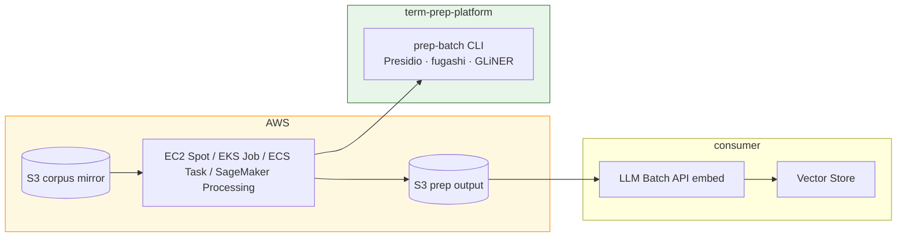
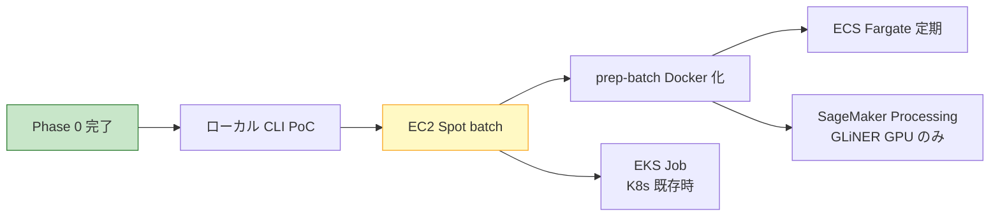

# 実装比較 — 難易度・実現可能性・コスト・メリット・デメリット

Status:
**計画のみ** — 2026-06-21 時点。数値は order-of-magnitude（桁の見積もり）。

Related:
[ARCHITECTURE.md](ARCHITECTURE.md) · [ROADMAP-AND-COSTS.md](ROADMAP-AND-COSTS.md) · [meta/glossary-pipeline/options/](../meta/glossary-pipeline/options/)

---

## 目的

Prep Platform の実装選択肢について、**実装難易度・実現可能性・コスト・メリット・デメリット**を一覧化する。ロードマップ各 Phase、Source Connector 選択肢、AWS バッチ基盤（EC2 / EKS / ECS / SageMaker）、代替基盤（ローカル / Cloudflare）を対象とする。

---

## 評価基準

### 実装難易度

| 記号 | 意味 | 目安 |
|---|---|---|
| **低** | 1–3 人日、既存資産で足りる | Phase 0 完了分、現状維持案 |
| **中** | 3–10 人日、設計判断が少数 | connector 移管、Presidio stub |
| **高** | 10 人日以上、または運用設計が重い | GLiNER 本実装、EKS、SageMaker 統合 |
| **極高** | 複数チーム・長期運用が前提 | （本 doc では該当案なし） |

### 実現可能性

| 記号 | 意味 |
|---|---|
| **◎** | 技術的に実証済み、または既存コードで着地可能 |
| **○** | 実現可能だが調整・追加設計が要る |
| **△** | 特定条件（GPU 大規模等）でのみ妥当 |
| **✗** | 現計画では採用しない |

### コストの読み方

- **開発工数:** 人日（1 人 × 1 営業日）
- **運用コスト:** USD、10,000 ページ × 5,000 文字/ページ規模を基準（[ROADMAP-AND-COSTS.md](ROADMAP-AND-COSTS.md) と同じ）
- **固定費:** 月額で発生するインフラ費用
- **API 課金:** OpenAI embed 等、consumer 側の従量課金

---

## 1. ロードマップ各 Phase

| Phase | 内容 | 難易度 | 実現性 | コスト | メリット | デメリット |
|---|---|:---:|:---:|---|---|---|
| **0** | extractor · JSON Schema | 低 | ◎ | 完了済み | adopt/hold 分割で Git diff 改善 · schema 検証で設定ミス防止 | パイプライン本体は未接続 · PII/sanitize なし |
| **0.5** | corpus mirror（S3 Python · Drive TS 流用） | 中 | ◎ | 開発 5–10 人日 · 運用 $0（mirror のみ） | fetch 重複解消 · prep 入口を一貫 · 既存 TS 実績流用 | OAuth · 差分 sync のスコープ管理 · polyglot（Python+TS） |
| **1–2** | Core 分離 · registry · filter/rank | 中 | ◎ | 開発 6–10 人日 · API $0 | テスト容易 · 移植性向上 · seed-first でノイズ削減 | 既存 CLI リファクタ · consumer 側 GLOSSARY 反映は別作業 |
| **2.5** | glossary-knowledge + GLiNER | 高 | ○ | 開発 8–13 人日 · venv +700 MB · RAM 2 GB | 一般語/ドメイン語の自動分類 · API 課金 $0 · batch 対応 | torch 依存 · CI +5–8 分 · ラベル設計・日本語精度の調整要 |
| **3** | pii-guard + sanitize（Presidio） | 中 | ◎ | 開発 2–3 人日（stub）· venv +150 MB · API $0 | 業界標準 PII 検出 · ポリシー operator 差分 · コストゼロ | 日本語 PII 精度不足（+1–2 人日）· 社内固有名詞は custom recognizer 要 |
| **4** | RAG term index（語↔chunk 逆引き） | 高 | ○ | 開発 10–15 人日 · API $0 | term-grounding · 用途 A/B 分離 · query expander 連携 | スキーマ設計複雑 · consumer embed との整合が必要 |
| **4.5** | RAG Vector connector（TS vector モード） | 中 | ◎ | 開発 5–8 人日 · embed ~$0.60/10k ページ（consumer） | Drive→prep→Vector を 1 本化 · 再実装回避 · 既存コード昇格 | platform スコープ拡大 · OpenAI 依存 · dopagaki 等は optional |

### Phase 別の詳細

#### Phase 0（完了）

- **提供物:** `glossary_extractor.py` · `meta/schemas/glossary-config.schema.json` · adopt/hold 分割出力
- **状態:** 動作中。MCP パイプライン本体は未接続

#### Phase 0.5（提案）

- **提供物:** `connectors/googledrive/`（TS 流用）· `scripts/connectors/s3.py` · corpus mirror contract
- **推奨方針:** [O-P007-004](../meta/glossary-pipeline/options/O-P007-004-googledrive-connector-reuse.md) — techdev-cursor `googledrive-connector.ts` を platform へ移管
- **フロー:** Google Drive / S3 → `build/corpus/` mirror → 既存 `glossary_extractor`

#### Phase 1–2

- **Phase 1:** `scripts/glossary/` Core 分離 · term registry（`scripts/glossary/registry.py`）
- **Phase 2:** filter / rank 強化 · seed-first で P-002（開世界ノイズ）を緩和

#### Phase 2.5

- **ツール:** [GLiNER](https://urchade.github.io/GLiNER/) — zero-shot NER
- **モデル候補:** `urchade/gliner_multi-v2.1`（日英）
- **stub 先行:** NullProvider 併存 · 本実装は MCP client · SQLite cache · batch adapter（+8–12 人日）

#### Phase 3

- **ツール:** [Microsoft Presidio](https://microsoft.github.io/presidio/) — `AnalyzerEngine` + `AnonymizerEngine`
- **モジュール:** `mcp/pii-guard/` · `mcp/sanitize/`
- **stub 推奨順:** Presidio は GLiNER より先（venv +150 MB · API $0）

#### Phase 4

- **用途:** 語 ↔ chunk 逆引き（P-005 対応）
- **配置:** `scripts/glossary/rag/` · SQLite / JSONL

#### Phase 4.5（提案）

- **提供物:** 同一 TS connector の `vector` モード — [O-P008-001](../meta/glossary-pipeline/options/O-P008-001-rag-vector-connector.md)
- **前提:** O-P007-004（Drive 流用）が先に着地していること

### stub 先行の推奨順（コスト対効果）

1. **Presidio stub**（pii-guard + sanitize）— venv +150 MB、API 課金 $0
2. **GLiNER provider stub**（glossary-knowledge）— venv +700 MB、RAM ピーク +1.5 GB
3. **Phase 0.5 connector** — ingest 基盤

---

## 2. Source Connector 選択肢（P-007 / P-008）

問題: [P-007](../meta/glossary-pipeline/PROBLEMS.md#p-007)（fetch 分散）· [P-008](../meta/glossary-pipeline/PROBLEMS.md#p-008)（Vector 投入の閉じ込め）

| Option | 方針 | 難易度 | 実現性 | コスト | メリット | デメリット |
|---|---|:---:|:---:|---|---|---|
| O-P007-002 | ingest は consumer のまま | 低 | ◎ | 開発 $0（現状維持） | platform スコープ最小 · Phase 0 変更不要 | consumer ごとに fetch 重複 · ストーリー弱い |
| O-P007-003 | rclone ラッパーのみ | 低 | ○ | 開発 1–2 人日 · rclone バイナリ依存 | Drive/S3 多数 backend を一括 · 実装最小 | OAuth 制御困難 · MCP は subprocess 前提 |
| O-P007-001 | Platform 薄型 SourceConnector | 中 | ◎ | 開発 3–5 人日（S3） | mirror→prep 一貫 · MCP/CLI 共通 contract | OAuth/sync は別途 · TS connector と役割重複リスク |
| **O-P007-004** | **googledrive-connector.ts 流用** | 中 | ◎ | 開発 5–10 人日（移管含む） | 実績あり · 二重実装回避 · vector モードと一体 | polyglot 運用 · npm workspace 設計 · 移行期間の二重管理 |
| O-P008-001 | Platform が Vector 投入も提供 | 中 | ○ | 開発 5–8 人日 · embed 従量（consumer） | 3 点バラ実装回避 · 1 config チェーン | OpenAI 依存 platform 侵入 · O-P007-004 前提 |

### 推奨: O-P007-004（Drive TS 流用）

**なぜ流用か**

| 理由 | 内容 |
|---|---|
| 実績 | OAuth · Drive API · 差分 sync · Vector 投入が既に TS で存在 |
| 重複回避 | platform 側で Drive SDK を二重実装しない |
| 一貫性 | techdev-cursor Phase 4「RAG prep hook」と同じコードベースで繋げられる |

**モード分離（同一 connector · 2 出口）**

| モード | 出力 | 用途 |
|---|---|---|
| `mirror` | ローカル `build/corpus/` | glossary prep · `corpus.files` |
| `vector` | OpenAI Vector Store | RAG 索引 — Phase 4.5 |

**移行ステップ（draft）**

1. platform に `connectors/googledrive/` を作成し、techdev-cursor からコピー + 依存を最小化
2. `mirror` API を追加（Vector 非経由でファイルだけ落とす）
3. techdev-cursor は platform パッケージを参照（sibling path または npm workspace）
4. consumer integration doc を更新

---

## 3. AWS サービス比較 — prep batch 向け

前提: corpus mirror が S3 上にあり、10,000 ページ × 5,000 文字/ページ（50 Mchars）を prep する batch job。ツールは Presidio · fugashi · GLiNER（CPU）。

| サービス | パターン | 難易度 | 実現性 | コスト | メリット | デメリット |
|---|---|:---:|:---:|---|---|---|
| **EC2 Spot** | VM 直接実行 · Spot Fleet | 中 | ◎ | ~$0.5–1/run · 固定費 $0 | 実装最も単純（User Data + 1 コマンド）· S3 直 read/write · Spot 60–90% 割引 · Presidio+fugashi+GLiNER を同一環境で一括実行可 | 並列・スケールは自前設計（shard チェックポイント）· Spot 中断耐性要 · コンテナ運用なし（環境ドリフトリスク） |
| **EKS** | K8s CronJob / Job · KEDA | 高 | ○ | ~$70+/月 固定 + ~$1/run | 定期 ingest に強い · 多 tenant / 複数 consumer を 1 クラスタで運用 · node pool 分離（Presidio CPU / GLiNER memory）· 既存 K8s 資産再利用 | コントロールプレーン固定費 · Job マニフェスト保守 · 単発・小規模はオーバーキル · 学習コスト高 |
| **ECS** | Fargate Task / EC2 launch type | 中 | ○ | Fargate ~$1–2/run · EC2 launch type は Spot 併用可 | Docker 前提で prep-batch イメージをそのまま実行 · K8s 不要 · EventBridge 定期起動 · タスク単位 IAM · EKS より軽量なオーケストレーション | Fargate は Spot EC2 より割高 · GLiNER 向け memory サイジング要 · 並列 shard は自前キュー（SQS）設計 · EKS ほどエコシステム豊富でない |
| **SageMaker** | Processing Job / Inference（GLiNER 特化） | 高 | △ | Processing ~$0.2–0.8/run（GLiNER 部分のみ）· 固定費 $0 | GLiNER batch inference のスケール・GPU 追加が容易 · S3 入出力ネイティブ · ML ワークロードの監視・ログ統合 · モデル更新パイプラインと接続しやすい | Presidio+fugashi 全体には過剰 · コールドスタート · コンテナ/entrypoint 制約 · CPU-only GLiNER では EC2/ECS より割高になりがち · platform 全体を載せる設計は複雑 |

### EC2 Spot（第一候補）

| 項目 | 内容 |
|---|---|
| **パターン** | Export → S3 `build/corpus/` → EC2 Spot Fleet が shard ごとに prep → 結果を S3 `build/prep/` へ |
| **インスタンス例** | Presidio / fugashi: `c6i.xlarge`（4 vCPU）· GLiNER: `r6i.xlarge`（32 GB RAM）または `m6i.2xlarge` |
| **Spot** | shard チェックポイント（S3 に page-id 単位完了マーカー）で中断耐性 — Spot 割引 60–90% |
| **IAM** | instance profile で S3 read/write — 認証情報を Job に埋め込まない |
| **向き** | 単発 PoC · 固定費最小 · Phase 0.5 S3 adapter と自然接続 |

**10k ページ概算（4 並列 · Spot）**

| リソース | コスト |
|---|---|
| EC2 Spot `c6i.xlarge` × 4 · 2.5 h | ~$0.50–0.80 |
| EC2 Spot `r6i.xlarge` × 1（GLiNER）· 1 h | ~$0.04–0.07 |
| S3 ストレージ + PUT/GET | <$0.01 |
| **合計 infra** | **~$0.5–1 / run** |

wall-clock: ローカル 4 vCPU ~3–4 h → EC2 4 並列 ~1–1.5 h

### EKS

| 項目 | 内容 |
|---|---|
| **パターン** | `CronJob` または手動 `Job` → N 並列 Pod（ページ shard）→ S3 入出力 |
| **ワークロード分割** | Presidio Job（CPU）· GLiNER Job（memory 多め）を別 node pool に分離可能 |
| **スケール** | KEDA（S3 キュー深度 / SQS）で Pod 数を burst · 終了後ゼロスケール |
| **向き** | 週次/月次の定期 ingest · 複数 consumer · **既存 K8s クラスタがある** |

**メリットが出る条件**

| 条件 | 評価 |
|---|---|
| corpus ≳ 1,000 ページ または ≳ 5 Mchars | ◎ |
| 夜間・週次の定期 ingest | ◎ |
| 開発 PC から torch / 2 GB RAM を追い出したい | ◎ |
| すでに EKS クラスタがある | ◎ 既存 infra 再利用 |
| 月 1 回 · 数百ページ以下 | ✗ コントロールプレーン固定費が重い |

### ECS

| 項目 | 内容 |
|---|---|
| **Fargate** | サーバーレスコンテナ · Task Definition + EventBridge で定期実行 · K8s 不要 |
| **EC2 launch type** | ECS クラスタ上の EC2（Spot 併用可）· Fargate より安価だが EC2 直接より一段複雑 |
| **向き** | prep-batch Docker イメージができた後 · K8s を持たないがコンテナ運用したい場合 |

**EC2 Spot との関係**

- ECS EC2 launch type + Spot = EC2 のコスト恩恵 + コンテナ再現性
- ECS Fargate = 運用簡素化だが ~$1–2/run と Spot 直接より割高

### SageMaker

| 項目 | 内容 |
|---|---|
| **Processing Job** | S3 入出力 · カスタム Docker · batch inference に適する |
| **Inference Endpoint** | リアルタイム向け — prep batch には不向き |
| **向き** | **GLiNER 段のみ** GPU 大規模化 · モデル更新パイプラインと統合する場合 |

**prep 全体を載せない理由**

| 段 | SageMaker 適合 | 採用予定 |
|---|---|---|
| PII | 専用 PII モデルなし | Presidio（EC2/ECS/Container） |
| sanitize | ポリシー operator 不足 | Presidio |
| extract | 形態素解析 | fugashi（軽量 CPU） |
| noise filter | NER batch | GLiNER — CPU なら EC2/ECS、GPU 大規模なら Processing Job |

### AWS 選択指針（prep パイプライン）

| 条件 | 推奨 | 備考 |
|---|---|---|
| 単発 · 初回 PoC · 固定費最小 | **EC2 Spot** | 実装 1–2 人日で launch template + S3 shard |
| 週次/月次の定期 ingest · K8s 既存 | **EKS Job** | CronJob + KEDA · 既存クラスタ必須 |
| Docker 化済み · K8s 不要 · 定期実行 | **ECS Fargate** | Task Definition + EventBridge |
| GLiNER のみ GPU / 大規模 inference | **SageMaker Processing** | prep 全体ではなく GLiNER 段のみ分離 |
| Presidio + fugashi + GLiNER 一括 | **EC2 Spot または ECS EC2 launch** | SageMaker は過剰 — 分割実行時のみ検討 |

### AWS batch アーキテクチャ（計画）



---

## 4. バッチ実行基盤 — 全体比較

AWS 以外の選択肢を含む全体像。

| 基盤 | 用途 | 難易度 | 実現性 | コスト | メリット | デメリット |
|---|---|:---:|:---:|---|---|---|
| ローカル CLI | 開発 PC / GitHub Actions | 低 | ◎ | $0 · PC 占有 3–4 h/10k ページ | セットアップ不要 · PoC に最適 | GLiNER で RAM 2 GB · 大規模は wall-clock 長い |
| AWS EC2 Spot | prep batch 第一候補 | 中 | ◎ | ~$0.5–1/run · 固定費 $0 | [§3 EC2](#ec2-spot第一候補) 参照 | 同上 |
| Cloudflare | R2 + Containers + D1 + Queues | 高 | ○ | $5/月 固定 + ~$1.1–1.2/run | egress $0 · scale-to-zero · D1/Queues 一体 · embed 安（Workers AI） | Container 必須（Workers 単体不可）· CF 学習コスト |

### Cloudflare（AWS 代替）

| 製品 | prep での役割 | Presidio / GLiNER |
|---|---|---|
| R2 | corpus mirror · prep 出力 | I/O 先 |
| Containers | Presidio · fugashi · GLiNER を Docker で実行 | 必須経路 |
| Queues | ページ shard メッセージ | ディスパッチ |
| Workflows | 多段 prep の orchestration | チェックポイント |
| D1 | term registry · classify cache · job 状態 | DB |
| Workers AI | embedding batch（consumer） | prep 本体には使わない |
| Vectorize | RAG 索引（consumer · Phase 4.5 代替） | — |

**AWS vs Cloudflare（10k ページ · 月次 run 比較）**

| | AWS（EC2 Spot） | Cloudflare |
|---|---|---|
| mirror / ストレージ | ~$0 | $0（無料枠） |
| prep compute | ~$0.55–0.87 | ~$0.75–0.85 |
| embed | ~$0.60（OpenAI Batch） | ~$0.36（Workers AI） |
| **固定費** | $0（単発 Spot） | $5/mo（Workers Paid） |
| **変動費 / run** | ~$1–2 | ~$1.1–1.2 |
| **月 1 run + 固定** | ~$1–2 | ~$6.2 |
| **月 4 run + 固定** | ~$4–8 | ~$9.4 |

**読み方**

- **単発・低頻度:** EC2 Spot が固定費なしで有利
- **Workers Paid 既契約 · R2 中心 · embed も CF:** 変動費は run あたり同等かやや安
- **月次 ingest が多い:** 両者とも変動 ~$1/run 台 — 差は既存契約・運用チームで決める

---

## 5. End-to-end コスト例（Confluence 10k ページ）

入力: 10,000 ページ × 5,000 文字 = 50 Mchars · ~30 M tokens

### Prep Platform（本 repo 範囲）

| 段 | ツール | 時間（4 並列 · EC2 Spot） | マネー |
|---|---|---|---|
| PII + sanitize | Presidio | ~0.5–1 h | $0（infra ~$0.5） |
| Term extract | fugashi | ~2–8 min | $0 |
| Noise filter | GLiNER | ~20–45 min | $0 |
| Term registry | 自前 Python | extract に含む | $0 |
| **Prep 小計** | | **~1–1.5 h** | **~$0.5–1** |

### Consumer 側（参考 · 本 repo 外）

| 項目 | 概算 |
|---|---|
| Chunk 数（500 tokens/chunk · 20% overlap） | ~70,000–80,000 chunks |
| Embedding（OpenAI Batch · $0.02/M tokens） | ~$0.60 |
| Vector Store 保管 | <$1/月 程度 |
| Phase 4.5 Vector 投入 | googledrive-connector `vector` モード |

### 合計

| レイヤ | AWS（EC2 Spot） | Cloudflare |
|---|---|---|
| **合計 / run** | **~$1–2** | **~$1.1–1.2** + $5/mo 固定 |

---

## 6. リスクと追加工数

| リスク | 影響 | 追加工数（目安） |
|---|---|---|
| Presidio 日本語 PII 精度 | 住所・電話の取りこぼし | custom recognizer +1–2 人日 |
| sanitize 社内固有名詞 | 標準 Presidio では不足 | regex / deny list recognizer +2–4 人日 |
| GLiNER ラベル設計 | general / domain 判定の精度 | 評価セット + 調整 +0.5–1 人日 |
| Confluence 直接 connector | Phase 0.5 に未含 | export API / HTML dump → mirror +3–5 人日 |
| ECS Fargate memory 不足 | GLiNER OOM | タスクサイズ見直し · EC2 launch type へ切替 |
| SageMaker 過剰設計 | 運用コスト・複雑性 | GLiNER 段のみに限定 |

---

## 7. 推奨方針（2026-06-21）

### 機能ロードマップ

1. **Phase 0.5:** O-P007-004（Drive TS 流用）+ S3 Python adapter
2. **Phase 4.5:** O-P008-001（同一 connector の `vector` モード）
3. **stub 先行:** Presidio → GLiNER → connector

### バッチ実行基盤

```text
単発 PoC · 固定費最小     → EC2 Spot（第一候補）
Docker 化後 · K8s 不要    → ECS Fargate（EventBridge 定期）
K8s 既存 · 多 tenant      → EKS Job + CronJob
GLiNER GPU 大規模のみ     → SageMaker Processing（段分離）
AWS 非利用 · CF 既契約    → Cloudflare Containers + R2
最小固定費 · 開発のみ     → ローカル CLI / GitHub Actions
```

### 段階的移行パス



---

## 8. Open Questions

1. **Confluence 取り込み** — export バッチで足りるか、専用 connector を Phase 0.5 に足すか
2. **PII + sanitize** — 1 MCP に統合するか 2 サーバのまま `_shared` で engine 共有するか
3. **GLiNER モデル** — `gliner_small-v2.1`（軽量）vs `gliner_multi-v2.1`（日英）
4. **AWS 第一選択** — 単発 EC2 Spot vs ECS Fargate vs 既存 EKS vs SageMaker（GLiNER 分離）
5. **Cloudflare ハイブリッド** — R2 + Containers のみ vs embed/Vector まで CF 統一
6. **LLM provider** — Bedrock batch vs OpenAI Batch vs Workers AI

---

## 参照

- [ARCHITECTURE.md](ARCHITECTURE.md)
- [ROADMAP-AND-COSTS.md](ROADMAP-AND-COSTS.md)
- [integrations/techdev-cursor.md](integrations/techdev-cursor.md)
- [meta/glossary-pipeline/PROBLEMS.md](../meta/glossary-pipeline/PROBLEMS.md)
- [O-P007-004](../meta/glossary-pipeline/options/O-P007-004-googledrive-connector-reuse.md)
- [O-P008-001](../meta/glossary-pipeline/options/O-P008-001-rag-vector-connector.md)
