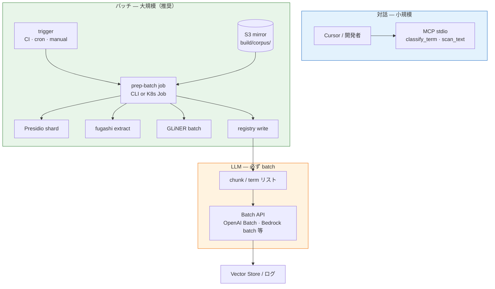
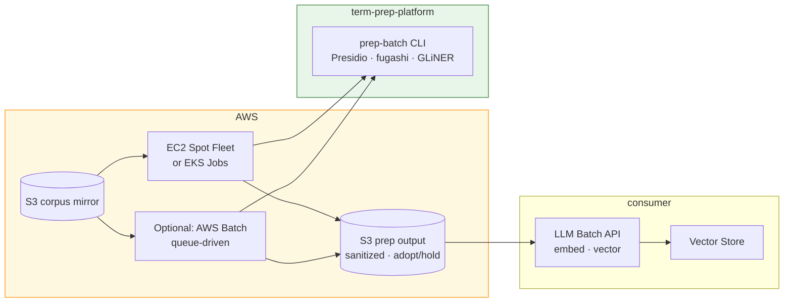
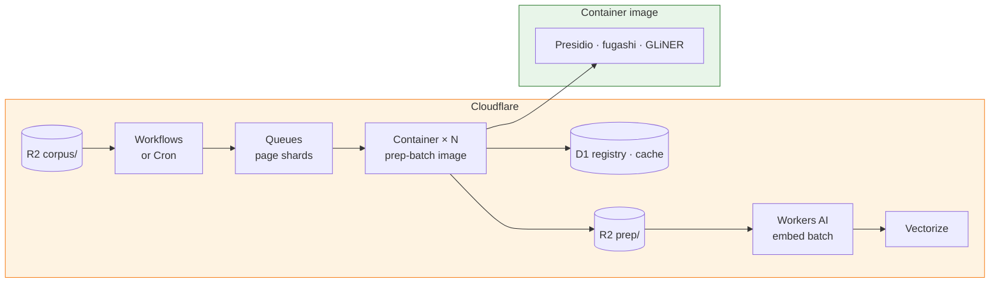

# 今後の方向性とコスト見積もり

Status:
**計画のみ** — 2026-06-21 時点。実装は未着手。

Related:
[ARCHITECTURE.md](ARCHITECTURE.md) · [IMPLEMENTATION-COMPARISON.md](IMPLEMENTATION-COMPARISON.md) · [IAC.md](IAC.md) · [TO-BE-PLATFORM.md](../meta/TO-BE-PLATFORM.md) · [TODO.md](../meta/TODO.md) · [MCP-CONTRACTS.md](MCP-CONTRACTS.md)

---

## 目的

Prep Platform の **今後の実装方針**、**課題ごとの採用予定ツール**、**開発・運用コストの概算**を 1 か所にまとめる。数値は order-of-magnitude（桁の見積もり）であり、PoC 前の計画用。

---

## 課題 → ツール対応表（採用予定）

| パイプライン段 | 課題 | 採用予定ツール / 実装 | MCP / モジュール | Phase | 備考 |
|---|---|---|---|---|---|
| **fetch / sync** | 外部 corpus の mirror | **S3:** Python adapter · **R2:** S3 互換（Cloudflare）· **Google Drive:** [`googledrive-connector.ts`](https://github.com/wombat2006/techdev-cursor/blob/master/src/services/googledrive-connector.ts) 流用 | `connectors/googledrive/` · `scripts/connectors/s3.py` | 0.5 | Confluence 直 fetch は **未計画** |
| **batch 実行基盤** | 大規模 prep · shard 並列 | **AWS:** EC2 Spot / EKS Job · **CF:** [Containers](https://developers.cloudflare.com/containers/) + [Queues](https://developers.cloudflare.com/queues/) + [Workflows](https://developers.cloudflare.com/workflows/) | `scripts/prep_batch.py`（予定） | 0.5+ | MCP 対話路は小規模専用 |
| **job メタ / cache DB** | term registry · 判定 cache · run 状態 | **ローカル:** SQLite · **CF:** [D1](https://developers.cloudflare.com/d1/) · **AWS:** RDS / DynamoDB（過剰） | `scripts/glossary/registry.py` · MCP cache | 2.5+ | D1 = scale-to-zero |
| **PII 検出・マスク** | 個人情報の検出・置換 | **[Microsoft Presidio](https://microsoft.github.io/presidio/)** — `AnalyzerEngine` + `AnonymizerEngine` | `mcp/pii-guard/` | 3（stub 先行） | spaCy モデル（en / ja） |
| **sanitize** | 組織ポリシー redaction | **Presidio** — operator プロファイル差（`replace` / `mask` / `redact`） | `mcp/sanitize/` | 4（stub 先行） | 社内固有名詞は将来 **custom recognizer** |
| **extract** | 専門用語候補の抽出 | **fugashi + UniDic-lite**（現行維持） | `scripts/glossary_extractor.py` · `mcp/term-extract/`（将来） | 0（CLI）/ 1+ | MeCab 系。大規模 corpus はバッチ CLI 主体 |
| **noise filter** | 一般語 / ドメイン語 / unknown | **[GLiNER](https://urchade.github.io/GLiNER/)** — zero-shot NER（config ラベル） | `mcp/glossary-knowledge/` | 2.5 | モデル候補: `urchade/gliner_multi-v2.1`（日英） |
| **term registry** | TS / ADR / GLOSSARY seed | **自前 Python**（rank / filter 強化） | `scripts/glossary/registry.py` | 1–2 | 外部 SaaS なし |
| **config 検証** | glossary-config 整合性 | **jsonschema**（導入済み） | `meta/schemas/` | 0 | done |
| **RAG term index** | 語 ↔ chunk 逆引き | **自前 Python** subpackage | `scripts/glossary/rag/` | 4 | SQLite / JSONL |
| **RAG Vector 投入** | OpenAI Vector Store 等 | **googledrive-connector.ts `vector` モード** · **CF 代替:** [Vectorize](https://developers.cloudflare.com/vectorize/) + [Workers AI](https://developers.cloudflare.com/workers-ai/) embed | `connectors/googledrive/` | 4.5 | embedding は **Batch API** · CF 経路は consumer 選択 |

**採用しない（当面）:** Guardrails `DetectPII` を主経路にしない（Presidio 薄ラッパで足りる）。LLM による noise filter 第一 provider も **Phase 2.5 本実装まで defer**（GLiNER を第一候補）。LLM を使う段階になっても **対話 1 件ずつではなく batch API / batch job** を前提とする（後述）。

---

## 実行モデル — バッチ優先

### 方針

| 実行経路 | 用途 | 想定規模 |
|---|---|---|
| **MCP stdio**（`classify_term` 等） | Cursor 対話 · 単語レビュー · PoC | 1 件〜数十件 |
| **MCP / CLI batch**（`classify_batch` · ページ shard） | CI · 夜間 job · corpus 再処理 | 数百〜数万ページ |
| **クラウド batch job**（EC2 / EKS / Batch） | 大規模 ingest · 並列 prep | 数千〜数万ページ以上 |
| **LLM provider batch** | embedding · 将来の LLM noise filter | 全文・全 chunk |

**原則:** corpus 全体を扱う処理は **常に batch**。MCP は batch tool の薄い入口として残すが、10,000 ページ級は **CLI または Job が正** — Cursor から 1 ページずつ MCP を叩く運用は計画対象外。



### 段ごとの batch 設計（予定）

| 段 | ツール | batch 単位 | 実装予定 |
|---|---|---|---|
| PII + sanitize | Presidio | **ページ / ファイル shard** | `scripts/prep_batch.py` · **CF:** Container Job · **AWS:** EC2/EKS |
| extract | fugashi | 同上 | `glossary_extractor` · Container 内実行 |
| noise filter | GLiNER | **`classify_batch`** | MCP + CLI · Container 内 batch inference |
| noise filter（将来 LLM） | OpenAI / Anthropic / **Workers AI** | **Batch API**（OpenAI）· **Workers AI batch**（CF 候補） | provider adapter |
| embedding | OpenAI / **Workers AI** | **Batch API** · `@cf/baai/bge-m3` 等 | consumer · Phase 4.5 |
| Vector 投入 | googledrive-connector / **Vectorize** | bulk upload · Vectorize index upsert | TS · vector モード |
| **job ディスパッチ** | shard キュー | **CF Queues** · **AWS SQS**（任意） | 1 ページ = 1 メッセージ（64 KB 未満） |
| **パイプライン orchestration** | 多段 prep | **CF Workflows** · Cron Trigger · **AWS Step Functions**（任意） | PII → extract → GLiNER → write |

### LLM を渡すときのルール（計画）

1. **小規模（<100 呼び出し）** — MCP `classify_term` / sync API 可（開発・レビュー用）。
2. **中規模（100–10,000 件）** — MCP `classify_batch` または CLI が内部で batch 分割。レート制限を守り **指数バックオフ**。
3. **大規模（10,000 件〜 · 全文 embed）** — **provider Batch API のみ**（OpenAI Batch · **Workers AI batch** 等）。同期 chat/completions で corpus を流さない。
4. **ログ** — batch job id · 入力 hash · 出力 path を `build/` に残す（C-0003 Traceability 準拠）。
5. **第一 noise filter** — GLiNER（ローカル batch）を優先。LLM provider は GLiNER で `unknown` 残りのみ **二段 batch** にする案を推奨（コスト・決定論）。

`glossary-config.json` の `knowledge_filter.batch_size`（既定 **50**）はこの方針に沿う。大規模 run では CLI / Job 側で shard 並列 × batch_size を組み合わせる。

---

## 実装ロードマップ（予定）

| 段階 | 内容 | 状態 | 開発工数（概算） |
|---|---|---|---|
| **0** | extractor · JSON Schema | **done** | — |
| **0.5 stub** | Source connector contract · S3 skeleton · Drive TS 移管計画 | 提案 | **5–10 人日**（Drive 移管含む） |
| **1** | `scripts/glossary/` Core 分離 · registry | 未着手 | **3–5 人日** |
| **2** | filter / rank 強化 | 未着手 | **3–5 人日** |
| **2.5 stub** | `glossary-knowledge` + **GLiNER provider**（NullProvider 併存） | stub のみ | **0.5–1 人日**（GLiNER 部分） |
| **3 stub** | **pii-guard** + **sanitize** Presidio アダプタ · `_shared/presidio.py` | 未着手 | **2–3 人日** |
| **2.5 本実装** | MCP client · SQLite cache · **LLM Batch adapter** · 第一 provider 確定 | 未着手 | **+8–12 人日** |
| **4** | RAG term index subpackage | 未着手 | **10–15 人日** |
| **4.5** | Vector connector hook | 提案 | **5–8 人日** |

**stub 先行の推奨順（コスト対効果）:**

1. **Presidio stub**（pii-guard + sanitize）— venv +150 MB、API 課金 $0  
2. **GLiNER provider stub**（glossary-knowledge）— venv +700 MB、RAM ピーク +1.5 GB  
3. Phase 0.5 connector — ingest 基盤（Confluence 例では export 経路の設計が先）

---

## 依存関係・環境コスト（1 開発マシン / CI）

| スタック | 主な依存 | venv 増分（目安） | RAM ピーク（1 プロセス） | クラウド API |
|---|---|---|---|---|
| **ベースライン**（現状） | mcp · fugashi · unidic-lite · jsonschema · MeCab | ~50–80 MB | ~100 MB | $0 |
| **+ Presidio** | presidio-analyzer · presidio-anonymizer · spacy · en/ja モデル | **+100–150 MB** | **400–600 MB** | $0 |
| **+ GLiNER** | torch（CPU）· transformers · gliner · HF モデル | **+700–900 MB** | **1.5–2.5 GB** | $0 |
| **フル prep スタック** | 上記すべて | **~1.0 GB 増** | **2–3 GB**（MCP 複数起動時） | $0 |

**CI 方針（予定）:** デフォルト job は Presidio 軽量 smoke のみ。GLiNER は optional workflow（torch  DL で **+5–8 分**）。

**optional requirements 分割（予定）:**

```text
requirements-mcp.txt            # mcp のみ（現状）
requirements-mcp-presidio.txt   # PII + sanitize
requirements-mcp-gliner.txt     # noise filter provider
```

---

## AWS EC2 / EKS — いつ使うか（計画）

ローカル開発マシン（WSL · ノート PC）で GLiNER + 50 Mchars prep を回す必要は **ない**。corpus mirror が S3 上にあるなら、**burst 並列 batch を EC2 / EKS に載せる**方向を推奨する。

### メリットが出る条件

| 条件 | EC2 | EKS |
|---|---|---|
| corpus **≳ 1,000 ページ** または **≳ 5 Mchars** | ◎ Spot / 複数台で wall-clock 短縮 | ○ Job 並列 |
| **夜間・週次** の定期 ingest | ◎ 起動 → 終了で課金停止 | ◎ CronJob |
| 開発 PC から **torch / 2 GB RAM** を追い出したい | ◎ | ◎ |
| すでに **EKS クラスタ** がある | △ 単発なら EC2 の方が簡単 | ◎ 既存 infra 再利用 |
| **月 1 回 · 数百ページ** 以下 | △ オーバーキル — GitHub Actions / 1 台 EC2 で足りる | ✗ コントロールプレーン固定費 |

### EC2（推奨: 第一歩）

| 項目 | 内容 |
|---|---|
| **パターン** | Export → **S3 `build/corpus/`** → **EC2 Spot Fleet** が shard ごとに prep → 結果を S3 `build/prep/` へ |
| **インスタンス例** | **Presidio / fugashi:** `c6i.xlarge`（4 vCPU）· **GLiNER:** `r6i.xlarge`（32 GB RAM）または CPU 十分な `m6i.2xlarge` |
| **Spot** | バッチは中断耐性を **shard チェックポイント**（S3 に page-id 単位完了マーカー）で確保 — **Spot 割引 60–90%** |
| **IAM** | instance profile で S3 read/write — 認証情報を Job に埋め込まない |
| **メリット** | 実装が単純（User Data + systemd / 1 コマンド）· EKS 固定費なし · Phase 0.5 S3 adapter と自然接続 |

### EKS（推奨: 定期 · 多 tenant · 既存 K8s あり）

| 項目 | 内容 |
|---|---|
| **パターン** | `CronJob` または手動 `Job` → **N 並列 Pod**（ページ shard）→ S3 入出力 |
| **ワークロード分割** | Presidio Job（CPU）· GLiNER Job（memory 多め）を **別 Deployment / node pool** に分離可能 |
| **スケール** | [KEDA](https://keda.sh/)（S3 キュー深度 / SQS）で Pod 数を burst · 終了後ゼロスケール |
| **メリット** | 複数 consumer PRJ の prep を **同一クラスタ**で運用 · secrets / IRSA · 観測（CloudWatch）統合 |
| **デメリット** | クラスタ固定費（コントロールプレーン等）· Job マニフェスト保守 — **小規模のみなら EC2 優先** |

### AWS 併用アーキテクチャ（計画）



**AWS Batch** は EC2 と EKS の中間 — キュー + Spot 自動プロビジョニング。EKS 未保有で **並列度だけ欲しい** 場合の候補（Phase 0.5 以降で評価）。

### Confluence 10k 例 — AWS 上の概算（参考）

前提: 4 並列 worker · PII+sanitize 統合 · GLiNER 1 台（または worker 内逐次）· **Spot**。

| リソース | 単価目安（us-east-1 級 · 2026 前後） | 使用量 | **コスト** |
|---|---|---|---|
| EC2 Spot `c6i.xlarge` × 4 | ~$0.05–0.08 / h each | 2.5 h | **~$0.50–0.80** |
| EC2 Spot `r6i.xlarge` × 1（GLiNER） | ~$0.04–0.07 / h | 1 h | **~$0.04–0.07** |
| S3 ストレージ + PUT/GET（150 MB 級） | 微量 | 1 run | **<$0.01** |
| EKS 控除（既存クラスタなし） | ~$70+ / 月 固定 | — | **単発なら EC2 優先** |
| LLM embed Batch（consumer） | $0.02 / M tokens | 30 M tokens | **~$0.60**（Batch も同オーダー） |

**wall-clock:** ローカル 4 vCPU **~3–4 h** → EC2 4 並列 **~1–1.5 h**（I/O 次第）。**infra 追加分は $1 未満 / run**（Spot · 単発）で、開発 PC を占有しない。

### 実装ロードマップへの追記（予定）

| Phase | AWS 関連 |
|---|---|
| **0.5** | S3 mirror contract · IAM read/write · `sync_corpus` → S3 · **Terraform: S3 + IAM**（[D-003](../meta/glossary-pipeline/DECISIONS.md#d-003)） |
| **1–3 stub** | ローカル CLI batch で PoC · `prep_batch --shard N/M` インタフェース |
| **3+ ops** | **Terraform:** EC2 Spot launch template · ECS task · EKS Job manifest は既存クラスタ時 |
| **2.5 LLM provider** | Batch API adapter のみ · sync path は MCP 小規模専用 |

---

## Cloudflare — 代替コンピューティング / DB（計画）

AWS EC2/EKS の **代替またはハイブリッド** として Cloudflare を使う案。公式単価は [R2](https://developers.cloudflare.com/r2/pricing/) · [Containers](https://developers.cloudflare.com/containers/pricing/) · [D1](https://developers.cloudflare.com/d1/platform/pricing/) · [Queues](https://developers.cloudflare.com/queues/platform/pricing/) · [Workers AI](https://developers.cloudflare.com/workers-ai/platform/pricing/) · [Vectorize](https://developers.cloudflare.com/vectorize/platform/pricing/) を参照（2026 年前後）。

### サービス → 課題対応（採用予定）

| Cloudflare 製品 | 代替するもの | prep での役割 | Presidio / GLiNER |
|---|---|---|---|
| **[R2](https://developers.cloudflare.com/r2/)** | S3 | corpus mirror · prep 出力 · **egress 無料**（R2↔Workers/Containers） | ○ I/O 先 |
| **[Containers](https://developers.cloudflare.com/containers/)** | EC2 / Batch | **Presidio · fugashi · GLiNER** を Docker で実行 | ◎ **必須経路** |
| **[Queues](https://developers.cloudflare.com/queues/)** | SQS | ページ shard メッセージ · batch ディスパッチ | ○ |
| **[Workflows](https://developers.cloudflare.com/workflows/)** | Step Functions | 多段 prep の orchestration · チェックポイント | ○ |
| **[D1](https://developers.cloudflare.com/d1/)** | SQLite / 軽量 RDB | term registry · `classify_batch` cache · job 状態 | ○ |
| **[Workers](https://developers.cloudflare.com/workers/)** | Lambda（軽量） | Queue 受信 · R2 トリガ · **重い ML は不可** | ✗ |
| **[Workers AI](https://developers.cloudflare.com/workers-ai/)** | OpenAI embed / 小規模 LLM | **embedding batch** · 将来 LLM noise filter 候補 | △ NER 代替は PoC 止まり |
| **[Vectorize](https://developers.cloudflare.com/vectorize/)** | OpenAI Vector Store | consumer 側 RAG 索引（Phase 4.5 代替） | — |

**Workers 単体では Presidio / GLiNER は動かない**（torch · MeCab · 長時間 CPU · メモリ制約）。重い prep は **Containers 必須**。Workers / Queues / Workflows は **batch の配線** に使う。

### メリットが出る条件

| 条件 | Cloudflare が有利 | AWS が有利 |
|---|---|---|
| corpus を **R2** に置き prep も CF 上 | R2 egress $0 · 同一アカウント内 I/O | 既存 S3 / IAM / VPC 統合 |
| **スパイク ingest**（月 1–2 回） | Containers scale-to-zero · 固定クラスタ不要 | EC2 Spot も同等に安い |
| **EKS を持たない** | Workflows + Queues で足りる | AWS Batch / EC2 |
| embed + Vector を **OpenAI 以外** に | Workers AI + Vectorize（従量・低固定費） | Bedrock / 自前 GPU |
| **既に Workers Paid** | $5/月 に vCPU/GiB 含む枠 | — |
| **長時間 GPU / 任意 OS** | △ Container インスタンスタイプ制約 | EC2 自由度高 |

### 参考単価（Workers Paid 前提）

| 製品 | 単価（抜粋） | 無料枠（Paid） |
|---|---|---|
| **R2** ストレージ | $0.015 / GB-month | 10 GB-month |
| **R2** Class A / B | $4.50 / M · $0.36 / M ops | 1M / 10M ops |
| **Containers** CPU | $0.000020 / vCPU-second（**アクティブのみ**） | 375 vCPU-min / 月 |
| **Containers** メモリ | $0.0000025 / GiB-second（プロビジョン） | 25 GiB-hour / 月 |
| **Containers** インスタンス | `standard-2`: 1 vCPU · 6 GiB · 12 GB disk | — |
| **D1** rows read / write | $0.001 / M reads · $1.00 / M writes | 25B reads · 50M writes / 月 |
| **D1** ストレージ | $0.75 / GB-month | 5 GB |
| **Queues** | $0.40 / M operations | 1M ops / 月 |
| **Workers AI** embed `@cf/baai/bge-m3` | **$0.012 / M input tokens** | 10k Neurons / 日 |
| **Vectorize** stored | $0.05 / 100M dimensions | 10M dimensions / 月 |
| **Workers Paid** 基本 | **$5 / 月** | 上記含む枠あり |

### Cloudflare batch アーキテクチャ（計画）



**流れ（Confluence 10k 想定）:**

1. Export → **R2** `corpus/`（Class A 10k PUT）
2. **Workflows** が run 開始 → **Queues** に 10,000 メッセージ（1 ページ = 1 msg · 5 KB 程度）
3. **Container `standard-2` × 4** が pull → Presidio + fugashi → 結果を R2 `prep/` + **D1**（候補語・判定 cache）
4. ユニーク候補 ~30k を **GLiNER batch**（同一 Container または dedicated 1 台 `standard-3`）
5. consumer: R2 `prep/` から chunk → **Workers AI embed**（batch）→ **Vectorize** upsert

### Confluence 10k 例 — Cloudflare 概算

前提: 4 × `standard-2` Container · wall-clock **~1.5 h** · CPU 平均 **80%** · Workers Paid · embed は Workers AI `@cf/baai/bge-m3`。

#### A. ストレージ · キュー · DB

| 項目 | 使用量 | 計算 | **コスト** |
|---|---|---|---|
| R2 ストレージ | ~0.3 GB-month（raw+sanitized） | 無料枠 10 GB 内 | **$0** |
| R2 Class A | ~20k PUT | 無料枠 1M 内 | **$0** |
| R2 Class B | ~50k GET（4 worker） | 無料枠 10M 内 | **$0** |
| Queues ops | 10k msg × 3 ≈ **30k ops** | 無料枠 1M 内 | **$0** |
| D1 writes | ~30k 判定 + ~10k registry | 無料枠 50M/月 内 | **$0** |
| D1 reads | ~100k（cache 参照） | 無料枠 25B/月 内 | **$0** |

#### B. Containers（prep 計算）

| 項目 | 計算 | **コスト** |
|---|---|---|
| CPU | 4 × 5400s × 0.8 vCPU-eff × $0.000020 ≈ **345 vCPU-min** | 含む枠 375 min 内 → **$0** |
| メモリ | 4 × 5400s × 6 GiB × $0.0000025 ≈ **324 GiB-hour** | 枠 25 GiB-h 超 → **~$0.75** |
| Workers / DO 従量 | リクエスト・ログ微量 | **~$0–0.10** |
| **Prep compute 小計** | | **~$0.75–0.85** |

※ 月内 2 回目以降は CPU 含む枠を超え **+$0.10–0.30/run** 程度。GLiNER を `standard-3`（2 vCPU · 8 GiB）追加 1h なら **+$0.15 前後**。

#### C. RAG（consumer · CF 経路）

| 項目 | 計算 | **コスト** |
|---|---|---|
| Workers AI embed | 30 M tokens × **$0.012/M** | **~$0.36** |
| Vectorize 格納 | 80k vectors × 768 dim ≈ **61M dim** | 超過分 ~51M × $0.05/100M ≈ **$0.03** |
| Vectorize クエリ | 10k queries/月 × 768 dim | ほぼ無料枠内 **~$0** |
| **RAG CF 小計** | | **~$0.39** |

#### D. CF 合計 vs AWS 合計（同一 10k 例）

| | **AWS（前節）** | **Cloudflare** |
|---|---|---|
| mirror / ストレージ | ~$0 | **$0**（無料枠） |
| prep compute | **~$0.55–0.87**（Spot） | **~$0.75–0.85**（Containers） |
| DB / キュー | —（ローカル or 別途） | **$0**（D1 · Queues 無料枠） |
| embed | **~$0.60**（OpenAI Batch） | **~$0.36**（Workers AI） |
| Vector | **~$0–1/mo**（OpenAI VS） | **~$0.03**（Vectorize 格納） |
| **固定費** | $0（単発 Spot） | **$5/mo**（Workers Paid 基本） |
| **変動費 / run** | **~$1–2** | **~$1.1–1.2**（固定費除く） |
| **月 4 run + 固定** | **~$4–8** | **~$5 + ~4.4 ≈ $9.4** |
| **月 1 run + 固定** | **~$1–2** | **~$5 + ~1.2 ≈ $6.2** |

**読み方:**

- **単発・低頻度:** EC2 Spot の方が **固定費なし** で有利。
- **Workers Paid 既契約 · R2 中心 · embed も CF:** 変動費は **run あたり同等かやや安** · egress・DB 一体。
- **月次 ingest が多い:** 両者とも **変動 ~$1/run 台** — 差は **既存契約・運用チーム** で決める。

### Workers AI / Vectorize を prep に使わない理由（計画）

| 課題 | Workers AI | 採用予定 |
|---|---|---|
| PII | 専用 PII モデルなし | **Presidio**（Container） |
| sanitize | ポリシー operator 不足 | **Presidio** |
| noise filter（第一） | NER 精度 · 決定論 · 日本語 | **GLiNER**（Container） |
| embed（consumer） | `@cf/baai/bge-m3` 等 **◎** | Workers AI **batch** |
| Vector（consumer） | **Vectorize ◎** | OpenAI VS の代替 |

### 実装ロードマップへの追記（CF）

| Phase | Cloudflare 関連 |
|---|---|
| **0.5** | R2 mirror contract（S3 API 互換 · adapter 共通化） |
| **1–3** | Container image（prep-batch）· Queues shard consumer |
| **2.5** | D1 cache schema · `classify_batch` 結果 write |
| **3+ ops** | Workflows 定義 · Cron · observability |
| **4.5（consumer）** | Workers AI embed batch · Vectorize upsert PoC |

### AWS vs Cloudflare — 選択指針

```text
既存 AWS + EKS あり     → EC2/EKS prep + S3（本 doc 前節）
CF Workers 既利用       → R2 + Containers + D1 + Queues
embed / Vector コスト削減 → Workers AI + Vectorize（consumer）
最小固定費・単発        → EC2 Spot または GitHub Actions + ローカル CLI
```

---

## リスクと追加工数（計画）

| リスク | 影響 | 追加工数（目安） |
|---|---|---|
| Presidio **日本語 PII** 精度 | 住所・電話の取りこぼし | custom recognizer **+1–2 人日** |
| sanitize **社内固有名詞** | 標準 Presidio では不足 | regex / deny list recognizer **+2–4 人日** |
| GLiNER **ラベル設計** | general / domain 判定の精度 | 評価セット + 調整 **+0.5–1 人日** |
| Confluence **直接 connector** | Phase 0.5 に未含 | export API / HTML dump → mirror **+3–5 人日**（必要時） |

---

## 概算例: Confluence 10,000 ページ × 5,000 文字 / ページ

### 入力規模

| 項目 | 値 |
|---|---|
| ページ数 | 10,000 |
| 1 ページあたり | 5,000 文字 |
| **総文字数** | **50,000,000 文字（50 Mchars）** |
| トークン換算（日英混在の目安） | **~25–35 M tokens**（以降 **30 M tokens** で試算） |
| 生テキスト容量（UTF-8 · 日本語多め） | **~140–150 MB** |

**前提:** Confluence は **HTML export または API export → `build/corpus/` mirror** 後に prep（Phase 0.5 の Confluence 専用 connector は未計画）。chunk 分割・embedding・Vector Store 投入は **consumer 側（Phase 4.5）**。

---

### A. Prep Platform 処理（本 repo 範囲）

| 段 | ツール | 処理単位 | 速度前提（CPU · 保守的） | **単一ワーカー** | **4 並列** |
|---|---|---|---|---|---|
| PII 検出 | Presidio `AnalyzerEngine` | 全 50 Mchars | ~3 s / 5,000 文字 | **~8.3 h** | **~2.1 h** |
| sanitize | Presidio `AnonymizerEngine` | 全 50 Mchars | PII と同オーダー（同一 pass 化可能） | **~8.3 h** ※別 pass 時 | **~2.1 h** ※ |
| extract | fugashi | 全 10,000 ページ | ~0.05 s / 5,000 文字 | **~8 min** | **~2 min** |
| noise filter | GLiNER | **ユニーク候補語**（全文ではない） | 下表参照 | **~0.5–1.5 h** | **~15–30 min** |

※ PII + sanitize を **1 MCP 呼び出し / 1 pass** にまとめれば、マスク込みで **~8–10 h → 4 並列 ~2–2.5 h** に圧縮可能（実装予定）。

**noise filter の候補語数（概算）:**

| 仮定 | ユニーク候補語数 | GLiNER（~100 ms/語 · CPU） | バッチ最適化後 |
|---|---|---|---|
| 保守的（Wiki 冗長） | ~50,000 語 | ~1.4 h | **~30–45 min** |
| 中央値 | ~30,000 語 | ~50 min | **~20–30 min** |
| 楽観（seed-first 後） | ~15,000 語 | ~25 min | **~10–15 min** |

**Prep 合計（中央値 · 4 並列 · PII+sanitize 統合 pass · EC2 Spot 想定）:**

| 項目 | ローカル 4 vCPU | **EC2 Spot 4 並列** |
|---|---|---|
| **CPU 時間（wall-clock）** | **~2.5–4 h** | **~1–1.5 h** |
| **RAM ピーク** | **~2 GB**（GLiNER） | worker 分散で **~2 GB/Pod またはインスタンス** |
| **infra 課金** | $0（PC 占有） | **~$0.5–1 / run** |
| **出力** | マスク後 corpus **~130–150 MB** + adopt/hold **数 MB–数十 MB** | 同上 · **S3 へ直接 write 可** |
| **Prep API 課金** | **$0** | **$0** |

---

### B. Consumer 側 — RAG 投入（参考 · 本 repo 外）

prep 後の sanitized corpus を chunk → embed → Vector Store 投入する場合の **参考値**（OpenAI 系の一般的単価）。

| 項目 | 前提 | 概算 |
|---|---|---|
| Chunk 数 | 500 tokens/chunk · 20% overlap | **~70,000–80,000 chunks** |
| Embedding | `text-embedding-3-small` @ **$0.02 / 1 M tokens** | 30 M tokens → **~$0.60** |
| Embedding 実行形態 | **[OpenAI Batch API](https://platform.openai.com/docs/guides/batch)**（推奨） | 同期 API より安価な場合あり · 24h 非同期 · **大規模は Batch 必須** |
| Vector Store 保管 | OpenAI hosted（2026 時点の一般的運用） | embedding と同オーダーで **<$1 / 月** 程度（要 provider 確認） |
| **Phase 4.5** Vector 投入 | googledrive-connector `vector` モード | 上記 API コスト + **開発済み TS 経路の再利用**（再実装コスト回避） |

---

### C. 例のサマリ表

**Confluence 10,000 × 5,000 文字 → RAG まで（end-to-end イメージ）**

| レイヤ | 担当 | ツール | 時間（概算） | マネー（概算） |
|---|---|---|---|---|
| Export → mirror | consumer / Phase 0.5 | Confluence export · S3 / 手動配置 | 運用依存 | $0（自前 infra） |
| PII + sanitize | platform | **Presidio** | ~2–2.5 h（4 並列 · 統合 pass）→ **EC2 なら ~0.5–1 h** | $0（infra ~$0.5） |
| Term extract | platform | **fugashi** | ~2–8 min | $0 |
| Noise filter | platform | **GLiNER** | ~20–45 min | $0 |
| Term registry | platform | **自前 Python** | extract に含む | $0 |
| Embed + Vector | consumer | **OpenAI Batch API** · TS connector | 非同期 ~数 h 窓 · wall-clock 待ち少 | **~$0.60**（embed · Batch 同オーダー） |
| **合計（AWS）** | | | **~1–1.5 h** · EC2 Spot 4 並列 | **~$1–2/run** |
| **合計（Cloudflare）** | | | **~1–1.5 h** · Containers 4 並列 | **~$1.1–1.2/run** + **$5/mo** 固定 |

数値は **batch job** 想定（ローカル 4 vCPU 単体 **~3–4 h**）。大規模 corpus は **mirror（S3/R2）→ prep-batch Job → LLM/Workers AI batch embed** を前提とする。AWS vs Cloudflare の比較は [Cloudflare 節](#cloudflare--代替コンピューティング--db計画) を参照。

---

## Open Questions（コストに効く未決事項）

1. **Confluence 取り込み** — export バッチで足りるか、専用 connector を Phase 0.5 に足すか  
2. **PII + sanitize** — 1 MCP に統合するか 2 サーバのまま `_shared` で engine 共有するか（RAM / 運用トレードオフ）  
3. **GLiNER モデル** — `gliner_small-v2.1`（軽量）vs `gliner_multi-v2.1`（日英 · ディスク +300 MB 程度）  
4. **noise filter 実行単位** — ユニーク surface 形のみ vs 文脈付きスニペット（精度 vs 時間）  
5. **第一 provider 確定** — GLiNER PoC 後に DECISIONS 更新（[RL-20260621](../research-log/RL-20260621-knowledge-filter-mcp.md)）  
6. **AWS 第一選択** — 単発 EC2 Spot vs AWS Batch vs 既存 EKS — org の既存 infra で決める  
7. **Cloudflare ハイブリッド** — R2 + Containers のみ vs embed/Vector まで CF 統一  
8. **LLM provider** — Bedrock batch vs OpenAI Batch vs **Workers AI** vs 自前 vLLM on EC2 GPU

---

## 参照

- Presidio: https://microsoft.github.io/presidio/
- GLiNER: https://urchade.github.io/GLiNER/
- Context7 調査サマリ（会話 2026-06-21）— PII/sanitize → Presidio、noise filter → GLiNER、extract → fugashi 維持
- [O-P007-004](../meta/glossary-pipeline/options/O-P007-004-googledrive-connector-reuse.md) · [O-P008-001](../meta/glossary-pipeline/options/O-P008-001-rag-vector-connector.md)
- Cloudflare: [R2 pricing](https://developers.cloudflare.com/r2/pricing/) · [Containers pricing](https://developers.cloudflare.com/containers/pricing/) · [D1 pricing](https://developers.cloudflare.com/d1/platform/pricing/) · [Workers AI pricing](https://developers.cloudflare.com/workers-ai/platform/pricing/) · [Vectorize pricing](https://developers.cloudflare.com/vectorize/platform/pricing/)
