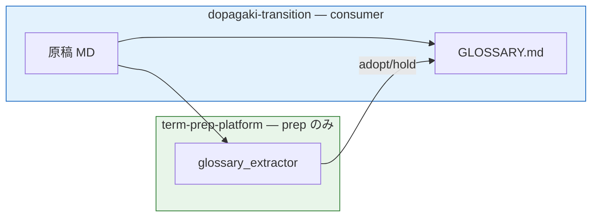

# Integration: dopagaki-transition

Consumer: [wombat2006/dopagaki-transition](https://github.com/wombat2006/dopagaki-transition)

---

## Role in platform flow

dopagaki-transition は **Outputs: glossary** 側 — 原稿 MD を ingest し、prep 後の adopt/hold を人間が `GLOSSARY.md` に反映する。**RAG は対象外**（用語集用途 A）。



提供範囲: [ARCHITECTURE.md](../ARCHITECTURE.md#scope--この-prj-が提供するもの)

---

## Use case

Research manuscript glossary — extract terms from Accepted chapters → human curation → `GLOSSARY.md` with TS/ADR links.

---

## Config

[projects/dopagaki-transition/glossary-config.json](../projects/dopagaki-transition/glossary-config.json) — **Phase 0** schema（起動時に [JSON Schema](../schemas/glossary-config.schema.json) で検証）。

**Note:** `project_root` points at dopagaki repo when running extractor:

```bash
cd /path/to/term-prep-platform
python scripts/glossary_extractor.py \
  --config projects/dopagaki-transition/glossary-config.json
```

Adjust `project_root` in config if layout differs.

### Config 注意点

| 項目 | 内容 |
|---|---|
| 検証 | platform の `glossary_extractor.py` が schema 検証 — 不一致は exit `1` |
| 依存 | platform `.venv` + `pip install -r requirements-dev.txt`（`jsonschema` 含む） |
| 出力 | `output.adopt` / `output.hold` を Git 追跡。reject は `emit_reject: true` 時のみ |
| テンプレ | [projects/_template/glossary-config.json](../../projects/_template/glossary-config.json) |

詳細: [meta/schemas/README.md](../../meta/schemas/README.md)

---

## Relationship

Platform extracted from dopagaki @ `5306a8b`. dopagaki keeps consumer copy of config and `GLOSSARY.md`; platform holds shared MCP + governance.
