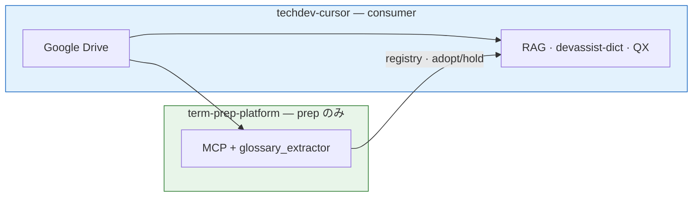

# Integration: techdev-cursor

Consumer: [wombat2006/techdev-cursor](https://github.com/wombat2006/techdev-cursor)

---

## Role in platform flow

techdev-cursor は **Outputs** 側 — ingest（Google Drive）と RAG index / bot dict / query expander を**保持**し、prep は本 repo の MCP + CLI を**参照**する。



提供範囲: [ARCHITECTURE.md](../ARCHITECTURE.md#scope--この-prj-が提供するもの)

---

## Use case

Google Drive → document fetch → **prep** → OpenAI Vector Store (existing `googledrive-connector.ts`).

Also: expand [devassist-dictionary-v0.json](https://github.com/wombat2006/techdev-cursor/blob/master/config/fork/devassist-dictionary-v0.json) from extracted terms.

---

## Config

[projects/techdev-cursor/glossary-config.json](../projects/techdev-cursor/glossary-config.json) — **Phase 0** schema (`filter` / `output` / `knowledge_filter`; adopt/hold split). 起動時に [JSON Schema](../schemas/glossary-config.schema.json) で検証。

Consumer copy in repo: [techdev-cursor/meta/glossary-config.json](https://github.com/wombat2006/techdev-cursor/blob/master/meta/glossary-config.json)

Set `corpus.files` when Drive sync local mirror path is fixed.

**Phase 0.5:** Google Drive corpus mirror は platform へ移管する **techdev-cursor [`googledrive-connector.ts`](https://github.com/wombat2006/techdev-cursor/blob/master/src/services/googledrive-connector.ts) の流用**が推奨方針（mirror モード）— [O-P007-004](../../meta/glossary-pipeline/options/O-P007-004-googledrive-connector-reuse.md)。

**Phase 4.5:** 同一 connector の **vector モード**で RAG Vector 投入も platform 共通化する案 — consumer 側の再実装を減らす（[P-008](../../meta/glossary-pipeline/PROBLEMS.md#p-008)）。techdev-cursor Phase 4 hook はこの公式パスに接続予定。

### Config 注意点

| 項目 | 内容 |
|---|---|
| 二重管理 | platform `projects/techdev-cursor/` は mirror。本番 `--config` は consumer の `meta/glossary-config.json` を指す |
| 検証 | どちらの config も同じ schema。編集後は `--check` で確認 |
| 依存 | platform 側で `.venv` を使い `requirements-dev.txt` をインストール（システム Python 単体 pip 不可） |
| schema 更新 | platform で config 形式を変えるときは `meta/schemas/` と consumer config を **同 PR / 同タイミング** で揃える |

詳細: [meta/schemas/README.md](../../meta/schemas/README.md)

### Output layout (consumer repo)

| Path | Git | Content |
|------|-----|---------|
| `meta/glossary-adopt.json` | ✅ | Adopt candidates |
| `meta/glossary-hold.json` | ✅ | Hold candidates |
| `meta/glossary-registry.json` | ✅ (Phase 2) | Registry seed — not yet |
| `meta/glossary-candidates.json` | ❌ | Legacy — gitignored in consumer |
| `build/glossary/reject.jsonl` | ❌ | Only if `emit_reject: true` |

---

## MCP registration

Add to techdev-cursor `.cursor/mcp.json` alongside `techsapo-providers`:

```json
"glossary-knowledge": {
  "command": "/path/to/term-prep-platform/.venv/bin/python",
  "args": ["-m", "glossary_knowledge_mcp"],
  "cwd": "/path/to/term-prep-platform/mcp/glossary-knowledge",
  "env": {
    "PYTHONPATH": "/path/to/term-prep-platform/mcp/glossary-knowledge"
  }
}
```

**Do not modify `techsapo-providers`.** `glossary-knowledge` is a separate stdio server for term classification (RAG prep).

---

## Verification

### Morphology check

```bash
python scripts/glossary_extractor.py --check \
  --config projects/techdev-cursor/glossary-config.json
```

### MCP stub — `classify_term` (NullProvider → unknown)

```bash
cd mcp/glossary-knowledge
PYTHONPATH=. python -c "
from glossary_knowledge_mcp.server import classify_term, list_providers
print(list_providers())
r = classify_term('Wall-Bounce', domain='devassist-platform')
assert r['label'] == 'unknown' and r['provider_id'] == 'null'
print('OK:', r)
"
```

Expected while `knowledge_filter.enabled: false`: all terms classified as `unknown` (stub).

### Legacy ignore (consumer)

```bash
cd /path/to/techdev-cursor
touch meta/glossary-candidates.json
git check-ignore -v meta/glossary-candidates.json
rm meta/glossary-candidates.json
```

---

## Insertion point (target)

```text
GoogleDriveRAGConnector.download/process
    → [term-prep MCP batch]   … Phase 2.5+
    → openai vector store upload
```

Dictionary export (planned):

```text
platform registry → devassist-dictionary-v0.json
  { term_id, surface } → { key, expansion, domain }
```

---

## forkProfile.yaml

Existing swappable `dictionary` path can point at exported JSON from this platform.
