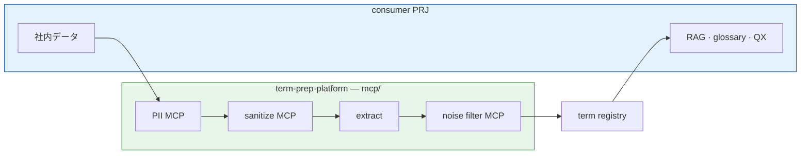

# MCP Servers

Shared stdio MCP tools for **data prep before RAG ingest** — part of [term-prep-platform](../README.md) Prep layer.

**本 repo が MCP で提供するもの:** PII 検出 · ポリシー redaction · 用語抽出 · ノイズ分類（Cursor / CI から stdio で呼ぶ）。  
**提供しない:** RAG indexing、corpus 保管、辞書の正典。

Register in consumer `.cursor/mcp.json` alongside project-specific MCPs (e.g. techsapo-providers).

---

## Position in target flow

Prep Platform パイプライン上、MCP は **社内データ ingest 後・term registry 前** の段を担う（registry 本体は `scripts/glossary/`）。



| MCP | Directory | Flow stage |
|---|---|---|
| PII | [pii-guard/](pii-guard/) | 1 — detect / mask / flag |
| sanitize | [sanitize/](sanitize/) | 2 — policy redaction |
| extract | [term-extract/](term-extract/) | 3 — fugashi candidate extraction |
| noise filter | [glossary-knowledge/](glossary-knowledge/) | 4 — general / domain / unknown |

Full diagram: [docs/ARCHITECTURE.md](../docs/ARCHITECTURE.md)

---

## Servers

| Directory | Purpose | Status |
|---|---|---|
| [pii-guard/](pii-guard/) | PII detect / mask / flag | planned |
| [sanitize/](sanitize/) | policy-based redaction | planned |
| [term-extract/](term-extract/) | fugashi candidate extraction as MCP | planned |
| [glossary-knowledge/](glossary-knowledge/) | general / domain / unknown classification | stub |

---

## Cursor registration (example)

```json
{
  "mcpServers": {
    "glossary-knowledge": {
      "command": "/path/to/term-prep-platform/.venv/bin/python",
      "args": ["-m", "glossary_knowledge_mcp"],
      "cwd": "/path/to/term-prep-platform/mcp/glossary-knowledge",
      "env": {
        "PYTHONPATH": "/path/to/term-prep-platform/mcp/glossary-knowledge"
      }
    }
  }
}
```

Requires Python >= 3.10 and `pip install -r requirements-mcp.txt`.

---

## Contracts

See [docs/MCP-CONTRACTS.md](../docs/MCP-CONTRACTS.md).
