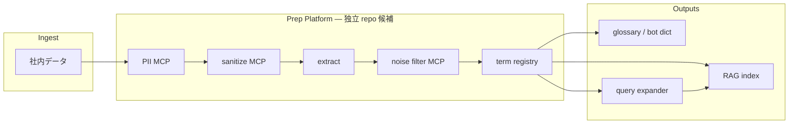

# TO-BE: Term Prep Platform

Project:
term-prep-platform

Status:
Draft — Technical

Origin:
Extracted from [dopagaki-transition](https://github.com/wombat2006/dopagaki-transition) @ 5306a8b (2026-06-21)

Related:
[README.md](../README.md)
[glossary-pipeline/](glossary-pipeline/README.md)
[docs/ARCHITECTURE.md](../docs/ARCHITECTURE.md)

---

## エンドツーエンド目標フロー

**Prep Platform として独立 repo 化する候補。** 社内データを consumer が ingest し、本 repo が前処理パイプラインを提供、**term registry** をハブに RAG・辞書・クエリ拡張へ fan-out する。



| フロー上の段 | 本 repo | 備考 |
|---|---|---|
| PII → sanitize | `mcp/pii-guard` · `mcp/sanitize` | ドキュメント単位。extract より前 |
| extract → noise filter | `mcp/term-extract` · `mcp/glossary-knowledge` | 候補語抽出とノイズ分類 |
| term registry | `scripts/glossary/registry.py` | TS / ADR / GLOSSARY seed。出口の正 |
| Outputs | consumer PRJ | RAG は `--rag-index`（Phase 4）で接続 |

**2 つの見方:** 上図は **データが流れる順**（ingest → prep → outputs）。下記「Core 内部」は **glossary_extractor が今実装している用語処理の順**（registry を seed として extract 前に読む）。最終的には上図の直列パイプラインに MCP + CLI を揃える。

---

## 設計方針 — 入口は固定、ロジックは別立て

**`scripts/glossary_extractor.py` は当面そのまま使う。** CLI・`--check`・exit code・config パスは **他 PRJ 共通の安定インタフェース** として維持する。

中身のパイプラインは **別モジュールとして切り出し、段階的に育てる**。いまの単一 `.py` に RAG・registry・複合語を詰め込まない。

```text
scripts/glossary_extractor.py     ← 薄い CLI（安定。他 PRJ もこの入口）
        │
        ▼ import
scripts/glossary/                 ← ロジック本体（別立てで改修・バージョンアップ）
    morphology.py                 … fugashi + 外部辞書（必須）
    extract.py                    … corpus → raw terms
    registry.py                   … TS/ADR/GLOSSARY seed（閉世界）
    filter.py                     … 閾値・stop・seed-first
    rank.py                       … スコア・複合語（将来）
    writers.py                    … adopt/hold/reject 出力分割
    rag/                          … RAG 前処理（将来 Epic。今は未実装でよい）
```

| 層 | 方針 |
|---|---|
| **CLI** (`glossary_extractor.py`) | 引数・config 読込・exit code のみ。破壊的変更は避ける |
| **Core** (`scripts/glossary/`) | 抽出・filter・出力形式をここで改修。ユニットテスト対象 |
| **Config** (`meta/glossary-config.json`) | 閾値・corpus・出力パス。PRJ ごとに差し替え |
| **正典** (`GLOSSARY.md`, TS, ADR) | 人間採択。機械出力は提案まで |

**RAG・大規模 corpus は Core の `rag/` サブパッケージとして後付け。** 現 CLI を差し替えない。

---

## AS-IS（2026-06-21）

| 項目 | 現状 |
|---|---|
| 構成 | 単一 `glossary_extractor.py`（~500 行、CLI+全ロジック同居） |
| 抽出 | fugashi + unidic-lite、名詞全量 + Markdown シグナル |
| 設定 | `meta/glossary-config.json` — stop 語・manual_adopt・閾値 |
| 出力 | adopt / hold / reject 分割（`write_outputs`） | **done** — Phase 0 |
| 正典 | 人間が `GLOSSARY.md` に反映 |

### 規模感（Accepted 原稿 7 ファイルのみ）

| 指標 | 値 |
|---|---|
| ファイルサイズ | ~255 KB |
| candidates 総数 | 693 |
| adopt / hold / reject | 23 / 23 / **647** |
| reject 比率 | ~93% |

全 Manuscript + ADR + TS + Research Log を同パイプラインに載せると、**MB 級 JSON・reject 数千件** が Git 管理下に乗る見込み。

### 構造的限界（技術的負債）

| # | 限界 | 影響 |
|---|---|---|
| L1 | 開世界抽出が先、閉世界 seed が後 | ノイズ大量 |
| L2 | reject を Git 追跡 JSON に含める | 肥大化 |
| L3 | 語 surface のみ（span/chunk なし） | RAG 不可 |
| L4 | 複合語未統合 | 「注意」「経済」≠「注意経済」 |
| L5 | スコアリングが catalog 部分一致で過敏 | `TS` `ADR` 等が adopt に混入 |
| L6 | CLI とロジック同居 | 他 PRJ への移植・テストが困難 |

---

## 用途の分離

### 用途 A — 読者向け用語集（GLOSSARY.md）

- 語数 **20–40** 程度
- 一行定義 + 誤解 + TS/ADR リンク
- **人間採択が正典**

### 用途 B — RAG / 専門用語辞典 PRJ

- 用語 ↔ 出典 ↔ chunk 索引
- embedding は別レイヤ
- 生成物は `build/` または DB（Git 外）

**同一 JSON・同一 writer に混ぜない。** 用途 A は `writers.adopt`、用途 B は `writers.rag`（将来）。

---

## 技術的改修一覧

優先度順。**Phase 0–1 は CLI インタフェースを変えずに Core 分離と出力整理のみ。**

### Phase 0 — 出力・リポジトリ衛生（Immediate） — **Done (2026-06-21)**

| ID | 改修 | 対象 | 完了条件 | Status |
|---|---|---|---|---|
| T0-1 | **reject 非出力** — `filter.emit_reject: false` デフォルト | extractor, config | reject が Git に載らない | **done** |
| T0-2 | **出力分割** — adopt / hold / reject を別ファイル | `write_outputs`, config | 3 パス設定可能 | **done** |
| T0-3 | **`glossary-candidates.json` 廃止** — adopt+hold の slim 版に置換 | config, docs | 単一巨大 JSON なし | **done** |
| T0-4 | **`.gitignore`** — `build/glossary/`, legacy candidates | consumer `.gitignore` | 生成物が commit されない | **done** |
| T0-5 | **生成物の正典位置づけ** — docs に「adopt のみ追跡」と明記 | README, integration docs | 誤コミット防止 | **done** |

Consumers synced: **dopagaki-transition**, **techdev-cursor** (platform config + consumer `meta/`).

### Phase 1 — モジュール分離（Immediate〜Mid）

| ID | 改修 | 対象 | 完了条件 |
|---|---|---|---|
| T1-1 | **`scripts/glossary/` パッケージ化** — 現 `glossary_extractor.py` から logic を移動 | 新 pkg + 薄い CLI | CLI 引数・exit code 不変 |
| T1-2 | **`morphology.py`** — fugashi + 辞書解決を独立 | glossary/morphology.py | `--check` が pkg 経由で動作 |
| T1-3 | **`writers.py`** — JSON/JSONL 出力を writer 戦略化 | glossary/writers.py | adopt/hold/reject 切替 |
| T1-4 | **config スキーマ** — `filter`, `output` 節を schema に反映 | meta/schemas/ | 設定ミスを早期検出 |

### Phase 2 — 縛り強化（Mid — Glossary 用途）

| ID | 改修 | 対象 | 完了条件 |
|---|---|---|---|
| T2-1 | **`registry.py`** — TS/ADR/GLOSSARY から seed 生成 | meta/glossary-registry.json | 正典語 ID 一覧 |
| T2-2 | **seed-first 抽出** — registry 語の出現を優先集計 | filter.py | 開世界全量より先に seed |
| T2-3 | **`min_morph_freq` / `min_chapters`** — 低頻度語を pre-score 除外 | filter.py, config | hold/adopt 件数が上限内 |
| T2-4 | **`max_candidates_output`** — 出力件数キャップ | filter.py | adopt+hold ≤ N |
| T2-5 | **catalog マッチ修正** — 部分一致による `TS`/`ADR` 誤 adopt 解消 | rank.py | 短語・メタ語が adopt に入らない |
| T2-6 | **複合語マージ** — seed 最長一致で「注意経済」等を統合 | rank.py | 分割候補が減る |
| T2-7 | **英日ペア統合** — `Attention Scarcity` ↔ 注意の有限性 | rank.py | 同一 entry に alias |

### Phase 2.5 — Knowledge Filter MCP（Mid — D-002）

registry + rule filter **の後**、rank **の前**。Phase 0–1 完了後に着手。

| ID | 改修 | 対象 | 完了条件 |
|---|---|---|---|
| T2.5-1 | **MCP server stub** — `classify_term`, `classify_batch`, NullProvider | `mcp/glossary-knowledge/` | Cursor / CLI から stdio 接続 |
| T2.5-2 | **MCP client** — glossary Core から batch 呼び出し | `glossary/knowledge_filter.py` | `enabled: false` で無害 |
| T2.5-3 | **cache layer** — SQLite、corpus hash 付き | MCP server | 再実行で API 再呼び出し抑制 |
| T2.5-4 | **第一 provider** — K-003 or K-006（DECISION 待ち） | MCP adapter | general/domain 判定が動作 |
| T2.5-5 | **判定ログ** — `build/glossary/knowledge-log.jsonl` | MCP + writers | C-0003 Traceability |

仕様: [glossary-pipeline/mcp/README.md](glossary-pipeline/mcp/README.md)。Research Log: [RL-20260621](../research-log/RL-20260621-knowledge-filter-mcp.md)。

---

| ID | 改修 | 対象 | 完了条件 |
|---|---|---|---|
| T3-1 | **adopt.json → GLOSSARY 差分提案** — 新規語・未定義語のリスト | 新 script or subcommand | 人間が反映する材料 |
| T3-2 | **registry ↔ GLOSSARY 双方向** — GLOSSARY 見出しを registry に自動反映 | registry.py | 用語集更新が seed に伝播 |

### Phase 4 — RAG 前処理（Long — 別 Epic）

| ID | 改修 | 対象 | 完了条件 |
|---|---|---|---|
| T4-1 | **term ID 安定化** — `term:attention-capacity` | glossary/rag/ids.py | PRJ 横断で同一 ID |
| T4-2 | **span 抽出** — file + line + 前後文 | glossary/rag/spans.py | 語ごとに出典スニペット |
| T4-3 | **chunk mapper** — 章/見出し/chunk 単位への逆引き | glossary/rag/chunks.py | RAG chunk と term がリンク |
| T4-4 | **term-index** — SQLite or JSONL | build/rag/ | 検索可能索引 |
| T4-5 | **incremental rebuild** — corpus 差分のみ再 index | glossary/rag/ | 全量再生成不要 |
| T4-6 | **shard 出力** — 章別 JSONL | build/glossary/shards/ | 大 corpus を分割処理 |

---

## TO-BE: 出力レイアウト

| ファイル | Git | 内容 |
|---|---|---|
| `meta/glossary-registry.json` | ✅ | TS/ADR/GLOSSARY 由来の正典語 |
| `meta/glossary-adopt.json` | ✅ | 採択候補のみ（数十件） |
| `meta/glossary-hold.json` | ⚠️ 任意 | 保留 |
| `build/glossary/reject.jsonl` | ❌ | reject（ローカル/CI artifact） |
| `build/glossary/shards/*.jsonl` | ❌ | 章別 raw（将来） |
| `build/rag/term-index.sqlite` | ❌ | RAG（将来） |

~~`meta/glossary-candidates.json`~~ → **廃止**（T0-3）。

---

## TO-BE: glossary-config 拡張

```json
{
  "morphology": {
    "backend": "fugashi",
    "dictionary": "unidic-lite",
    "required": true
  },
  "filter": {
    "seed_first": true,
    "min_morph_freq": 3,
    "min_chapters": 2,
    "max_candidates_output": 100,
    "emit_reject": false
  },
  "knowledge_filter": {
    "enabled": false,
    "mcp_server": "mcp/glossary-knowledge",
    "transport": "stdio",
    "domain": "attention-economics",
    "batch_size": 50
  },
  "output": {
    "registry": "meta/glossary-registry.json",
    "adopt": "meta/glossary-adopt.json",
    "hold": "meta/glossary-hold.json",
    "reject": "build/glossary/reject.jsonl"
  }
}
```

---

## パイプライン TO-BE（Core 内部）

エンドツーエンドの流れ（社内データ → PII → … → registry → RAG）は [エンドツーエンド目標フロー](#エンドツーエンド目標フロー) を参照。以下は **glossary_extractor Core** が段階的に実装する用語処理の内部順序。

```text
[registry]  TS / ADR / GLOSSARY → seed（閉世界）
     ↓
[extract]   fugashi + 辞書 — corpus → raw（shard 可）
     ↓
[filter]    min_freq, stop, seed-first, valid_term
     ↓
[knowledge] MCP classify_batch（Phase 2.5, optional）
     ↓
[rank]      スコア, 複合語, 英日ペア
     ↓
[writers]   adopt / hold / reject（分離）
     ├─→ GLOSSARY.md（人間）     … Outputs: glossary / bot dict
     └─→ rag/（将来）            … Outputs: RAG index（query expander は consumer）
```

---

## 実装ロードマップ

| Phase | 内容 | CLI 変更 |
|---|---|---|
| **0** | 出力分割・gitignore・candidates 廃止 | なし |
| **1** | `scripts/glossary/` 分離 | なし（import 先のみ） |
| **2** | registry + filter 強化 | なし |
| **2.5** | Knowledge Filter MCP（D-002） | なし（config `knowledge_filter.enabled`） |
| **3** | GLOSSARY 差分提案 | `--diff-glossary` 追加可 |
| **4** | RAG subpackage | `--rag-index` 追加可 |

**原則:** 既存 `python scripts/glossary_extractor.py` は Phase 0–2 まで **そのまま動く**。

---

## Open Questions

1. **registry 正典** — TS のみ vs TS+ADR+GLOSSARY のマージルール
2. **未知語昇格** — 開世界候補を registry に入れる ADR / Research Log フロー
3. **RAG 配置** — 本 repo `build/rag/` vs 専門用語辞典 PRJ
4. **UniDic 標準** — unidic-lite（pip）vs full UniDic（他 PRJ 共通）
5. **Core の配布** — 各 repo に `scripts/glossary/` コピー vs 将来 pip package 化
6. **Knowledge Filter 第一 provider** — K-003 / K-006 / K-008（[RL-20260621](../research-log/RL-20260621-knowledge-filter-mcp.md)）

---

## 判定

| 問い | 答え |
|---|---|
| 今の py を捨てるか | **捨てない** — CLI 入口として維持 |
| ロジックの育て方 | **`scripts/glossary/` に別立て** — Phase 1 で切り出し |
| RAG は今やるか | **しない** — Phase 4。To-Be に要件のみ |
| 今すぐやる改修 | **Phase 0**（出力分割・reject 非追跡）が最優先 |
