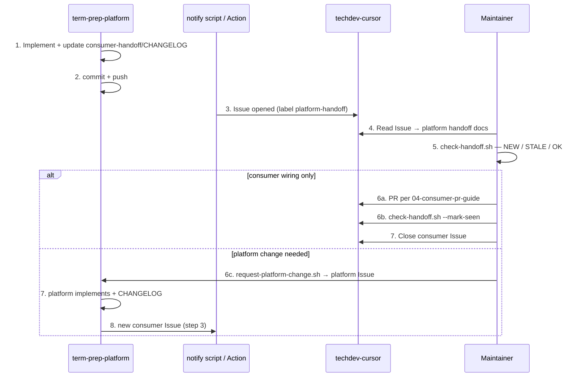

# Cross-repo workflow (A + C hybrid · bot)

**Read as:** How **term-prep-platform** and **techdev-cursor** coordinate without cross-repo commits.  
**Status:** Active (2026-06-21)

---

## Summary

| Leg | Mechanism | Who acts |
|-----|-----------|----------|
| **A** | Consumer **PR** (manual, spec in [04](./04-consumer-pr-guide-techdev-cursor.md)) | Consumer maintainer |
| **C** | Platform **bot → Issue** on consumer | `notify_consumer_issue.sh` / GitHub Action |
| **Reverse** | Consumer **Issue** on platform | `scripts/platform-handoff/request-platform-change.sh` |

**Neither repo's agents edit the other repo directly.**

---

## Sequence



---

## Platform (term-prep-platform)

### On every consumer-affecting push

1. Update `meta/consumer-handoff/CHANGELOG.md` (new `## YYYY-MM-DD — title` entry at top).
2. Update `01` / `02` / `04` / `05` if contract or PR spec changed.
3. `git push` — Action runs **C** (Issue on consumer) when `meta/consumer-handoff/**` changes.

### Scripts

| Script | Role |
|--------|------|
| [scripts/cross_repo/notify_consumer_issue.sh](../../scripts/cross_repo/notify_consumer_issue.sh) | Open consumer Issue (dedupe by CHANGELOG entry id) |
| [scripts/cross_repo/install_consumer_scripts.sh](../../scripts/cross_repo/install_consumer_scripts.sh) | Copy templates into consumer clone for PR branch |
| [scripts/cross_repo/handoff_changelog.py](../../scripts/cross_repo/handoff_changelog.py) | Parse latest CHANGELOG entry |

### Local dry-run

```bash
export CROSS_REPO_GH_TOKEN=ghp_...
./scripts/cross_repo/notify_consumer_issue.sh --dry-run
```

### GitHub Action

[`.github/workflows/consumer-handoff-notify.yml`](../../.github/workflows/consumer-handoff-notify.yml) — requires secret **`CROSS_REPO_GH_TOKEN`** (fine-grained or classic PAT with `issues:write` on consumer repo).

Optional label **`platform-handoff`** on consumer repo (create once):

```bash
gh label create platform-handoff --repo wombat2006/techdev-cursor \
  --description "term-prep-platform handoff notification" --color 0E8A16
```

---

## Consumer (techdev-cursor)

### Install scripts (include in consumer PR)

From platform repo:

```bash
./scripts/cross_repo/install_consumer_scripts.sh
# copies to ../techdev-cursor/scripts/platform-handoff/
```

Or copy [consumer-templates](../../scripts/cross_repo/consumer-templates/) manually.

### After receiving Issue

```bash
# techdev-cursor root
./scripts/platform-handoff/check-handoff.sh
# read platform meta/consumer-handoff/ per Issue links
# if PR needed: 04-consumer-pr-guide-techdev-cursor.md
./scripts/platform-handoff/check-handoff.sh --mark-seen
```

### Request platform work

```bash
export CROSS_REPO_GH_TOKEN=...
./scripts/platform-handoff/request-platform-change.sh \
  --title "your request" --body "details"
```

---

## Secrets

| Secret | Where | Scope |
|--------|-------|-------|
| `CROSS_REPO_GH_TOKEN` | platform Actions + local bot | `issues:write` on **consumer** repo (notify); consumer uses same for platform issues |
| `GITHUB_TOKEN` | default Actions | **Insufficient** for cross-repo issues — use PAT |

---

## Deduping

`notify_consumer_issue.sh` skips if an **open** issue with label `platform-handoff` matches the latest CHANGELOG entry id (`YYYY-MM-DD — title`).

---

## What not to do

- Platform bot opening **commits** on consumer (Issues only for C; PRs remain human-driven A)
- Mirror full `consumer-handoff/` tree into techdev-cursor
- Consumer PRs that add extractor / connector **implementation** on platform

---

## Related

- [04-consumer-pr-guide-techdev-cursor.md](./04-consumer-pr-guide-techdev-cursor.md)
- [scripts/cross_repo/README.md](../../scripts/cross_repo/README.md)
- Cursor skill: `.cursor/skills/consumer-handoff/SKILL.md`
- Cursor agents (read-only opinions): `.cursor/agents/README.md`
