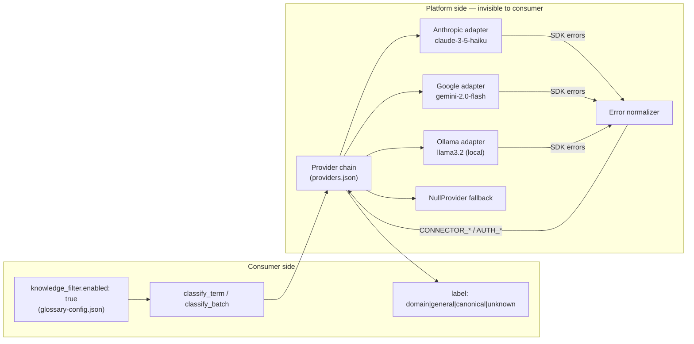

# LLM Provider Policy

Status:
Draft v1 (2026-06-29)

SDK references: Anthropic SDK Python, Google Gen AI Python SDK, Ollama Python
(fetched from Context7 at 2026-06-29)

---

## Core principle: provider is invisible to consumers

Adding Anthropic, Google, or Ollama as a provider requires **zero changes** to any
consumer repo. Provider selection, fallback, and error normalization all happen inside
the `glossary-knowledge` MCP server. Consumers see only the normalized
`KnowledgeClassification` output and platform-standard `ErrorEnvelope` codes.



---

## Consumer config contract (`knowledge_filter`)

The only consumer-configurable section. Documented in
`meta/schemas/glossary-config.schema.json`.

```json
{
  "knowledge_filter": {
    "enabled": true,
    "mcp_server": "glossary-knowledge",
    "transport": "stdio",
    "domain": "devassist-platform",
    "batch_size": 50
  }
}
```

| Field | Default | Consumer can set? | Notes |
|---|---|---|---|
| `enabled` | `false` | yes | Master switch |
| `mcp_server` | `"glossary-knowledge"` | yes | MCP server name in `.cursor/mcp.json` |
| `transport` | `"stdio"` | yes | `stdio` only until Plan B remote service |
| `domain` | — | yes | Passed to LLM as domain context |
| `batch_size` | 50 | yes | Platform rechunks internally if needed |

**Intentionally absent:** `provider_preference`, `model`, `api_key`. These are
platform deployment concerns only.

---

## Output stability across providers

`KnowledgeClassification.label` is the sole stable output. The `label` enum is
identical regardless of which LLM runs:

- `canonical` — term is already in the term registry
- `domain` — recognized as domain-specific
- `general` — identified as a common word
- `unknown` — no determination made (including fallback/stub)

**`provider_id` is informational only.** Value changes when the platform operator
switches providers. Consumer code must not branch on this field.

```python
# Correct consumer usage
if result["label"] in ("domain", "canonical"):
    adopt_term(result["candidate_id"])

# Wrong — do NOT do this
if result["provider_id"] == "anthropic-claude":
    ...
```

---

## Platform-side provider adapter pattern

Each provider adapter implements the existing `Provider` ABC in
`mcp/glossary-knowledge/glossary_knowledge_mcp/providers.py`.

### Actual SDK call signatures (from Context7 docs)

**Anthropic (`client.messages.create`):**

```python
import anthropic

client = anthropic.Anthropic(api_key=os.environ["ANTHROPIC_API_KEY"])

message = client.messages.create(
    model="claude-3-5-haiku-20241022",
    max_tokens=64,
    messages=[
        {
            "role": "user",
            "content": CLASSIFY_PROMPT.format(term=term, domain=domain)
        }
    ],
)
label_text = message.content[0].text.strip().lower()
```

**Google Gen AI (`client.models.generate_content`):**

```python
from google import genai
from google.genai import types

client = genai.Client(api_key=os.environ["GOOGLE_API_KEY"])

response = client.models.generate_content(
    model="gemini-2.0-flash-001",
    contents=CLASSIFY_PROMPT.format(term=term, domain=domain),
    config=types.GenerateContentConfig(
        max_output_tokens=64,
        temperature=0,
    ),
)
label_text = response.text.strip().lower()
```

**Ollama (`client.chat`):**

```python
from ollama import Client as OllamaClient

client = OllamaClient(host=os.environ.get("OLLAMA_HOST", "http://localhost:11434"))

response = client.chat(
    model=self._model,
    messages=[
        {"role": "user", "content": CLASSIFY_PROMPT.format(term=term, domain=domain)}
    ],
    options={"temperature": 0, "num_predict": 64},
)
label_text = response.message.content.strip().lower()
```

### Prompt contract (shared across all providers)

```python
CLASSIFY_PROMPT = """\
Classify the term below as exactly one of: domain / general / unknown.

Term: {term}
Domain context: {domain}

Reply with one word only: domain, general, or unknown."""
```

The prompt is the same for all providers. Temperature 0 and low `max_tokens` (64)
are mandatory to minimize variance.

---

## Error normalization table

Provider SDK exceptions are caught inside the adapter and re-raised as
`ConnectorError` (see `connector-spi.md`) using platform standard codes.
Consumers never see provider-native exception types.

### Anthropic → platform codes

| Anthropic exception | HTTP status | Platform code | retryable |
|---|---|---|---|
| `RateLimitError` | 429 | `CONNECTOR_RATE_LIMITED` | true |
| `OverloadedError` | 529 | `CONNECTOR_UNAVAILABLE` | true |
| `AuthenticationError` | 401 | `AUTH_INVALID_KEY` | false |
| `BillingError` | 403 | `AUTH_QUOTA_EXCEEDED` | false |
| `APITimeoutError` | — | `CONNECTOR_TIMEOUT` | true |
| `APIConnectionError` | — | `CONNECTOR_TIMEOUT` | true |
| Other `APIStatusError` | 4xx/5xx | `INTERNAL_PROVIDER_ERROR` | false |

```python
# Anthropic adapter error normalization pattern
import anthropic

try:
    message = client.messages.create(...)
except anthropic.RateLimitError as e:
    raise ConnectorError("CONNECTOR_RATE_LIMITED", str(e), retryable=True)
except anthropic.AuthenticationError as e:
    raise ConnectorError("AUTH_INVALID_KEY", str(e), retryable=False)
except anthropic.BillingError as e:
    raise ConnectorError("AUTH_QUOTA_EXCEEDED", str(e), retryable=False)
except anthropic.OverloadedError as e:
    raise ConnectorError("CONNECTOR_UNAVAILABLE", str(e), retryable=True)
except anthropic.APITimeoutError as e:
    raise ConnectorError("CONNECTOR_TIMEOUT", str(e), retryable=True)
except anthropic.APIConnectionError as e:
    raise ConnectorError("CONNECTOR_TIMEOUT", str(e), retryable=True)
```

### Google Gen AI → platform codes

| Google `errors.APIError.code` | Platform code | retryable |
|---|---|---|
| 401 | `AUTH_INVALID_KEY` | false |
| 403 | `AUTH_QUOTA_EXCEEDED` | false |
| 429 | `CONNECTOR_RATE_LIMITED` | true |
| 503 | `CONNECTOR_UNAVAILABLE` | true |
| 504 | `CONNECTOR_TIMEOUT` | true |
| Other 4xx/5xx | `INTERNAL_PROVIDER_ERROR` | false |

```python
# Google adapter error normalization pattern
from google.genai import errors as genai_errors

try:
    response = client.models.generate_content(...)
except genai_errors.APIError as e:
    _GOOGLE_CODE_MAP = {
        401: ("AUTH_INVALID_KEY", False),
        403: ("AUTH_QUOTA_EXCEEDED", False),
        429: ("CONNECTOR_RATE_LIMITED", True),
        503: ("CONNECTOR_UNAVAILABLE", True),
        504: ("CONNECTOR_TIMEOUT", True),
    }
    code, retryable = _GOOGLE_CODE_MAP.get(
        e.code, ("INTERNAL_PROVIDER_ERROR", False)
    )
    raise ConnectorError(code, e.message, retryable=retryable)
```

### Ollama → platform codes

| Ollama exception | Condition | Platform code | retryable |
|---|---|---|---|
| `ResponseError` | `status_code == 404` | `AUTH_MODEL_NOT_FOUND` | false |
| `ResponseError` | `status_code == 429` | `CONNECTOR_RATE_LIMITED` | true |
| `ResponseError` | other | `INTERNAL_PROVIDER_ERROR` | false |
| `ConnectionError` | — | `CONNECTOR_UNAVAILABLE` | true |

```python
# Ollama adapter error normalization pattern
from ollama import ResponseError as OllamaResponseError, \
                   ConnectError as OllamaConnectError

try:
    response = client.chat(...)
except OllamaResponseError as e:
    if e.status_code == 404:
        raise ConnectorError("AUTH_MODEL_NOT_FOUND",
            f"Model not found: {self._model}", retryable=False)
    elif e.status_code == 429:
        raise ConnectorError("CONNECTOR_RATE_LIMITED", e.error, retryable=True)
    else:
        raise ConnectorError("INTERNAL_PROVIDER_ERROR", e.error, retryable=False)
except OllamaConnectError as e:
    raise ConnectorError("CONNECTOR_UNAVAILABLE",
        f"Cannot connect to Ollama at {self._host}", retryable=True)
```

---

## Platform-side `providers.json` format

Platform operators (not consumers) configure the provider chain here:

```json
{
  "providers": [
    {
      "id": "anthropic-claude",
      "type": "llm",
      "llm_backend": "anthropic",
      "model": "claude-3-5-haiku-20241022",
      "max_tokens": 64
    },
    {
      "id": "google-gemini",
      "type": "llm",
      "llm_backend": "google",
      "model": "gemini-2.0-flash-001",
      "max_tokens": 64
    },
    {
      "id": "ollama-llama",
      "type": "llm",
      "llm_backend": "ollama",
      "model": "llama3.2",
      "host": "http://localhost:11434"
    },
    {
      "id": "null",
      "type": "null"
    }
  ],
  "default_chain": ["anthropic-claude", "google-gemini", "ollama-llama", "null"],
  "cache": "build/glossary/knowledge-cache.sqlite",
  "fail_mode": "unknown"
}
```

`default_chain` is evaluated left to right. The first provider returning a
non-`unknown` label wins. `null` at the end ensures the chain never errors out.

**Auth: environment variables only (never in providers.json):**

| Provider | Required env var |
|---|---|
| Anthropic | `ANTHROPIC_API_KEY` |
| Google | `GOOGLE_API_KEY` |
| Ollama (local) | none (default `http://localhost:11434`) |
| Ollama (cloud) | `OLLAMA_HOST`, `OLLAMA_API_KEY` |

---

## Adding a new provider: impact matrix

| Actor | Action required? | What changes? |
|---|---|---|
| Consumer | **No** | nothing |
| Platform developer | Yes | New adapter class in `mcp/glossary-knowledge/glossary_knowledge_mcp/providers.py` |
| Platform operator | Yes | Add entry to `providers.json`, set env var |
| CI (platform) | Yes | Add conformance test for error normalization |
| CI (consumer) | **No** | contract check remains `--expect-major 1` |

Platform developer checklist for a new provider:

1. Add adapter class implementing `Provider` ABC (`classify` method)
2. Normalize all SDK exceptions → `ConnectorError` using standard codes
3. Add entry to `build_provider_chain` type switch in `providers.py`
4. Add env var entry to platform documentation
5. Run `classify_term` / `classify_batch` conformance tests
6. Update `CHANGELOG.md` (consumer-facing note: "no action required")

---

## Ollama: special considerations

Ollama is the only provider that runs locally without a network API key.

| Aspect | Behavior | Consumer impact |
|---|---|---|
| Default host | `http://localhost:11434` | none — set by platform via `providers.json` |
| Auth | none for local; `OLLAMA_API_KEY` for cloud | none |
| Model availability | must be pulled first (`ollama pull llama3.2`) | none — platform checks at startup |
| CI environments | Ollama not installed by default; chain falls through to next provider | none — consumer CI sees no failure |
| Latency | higher than API providers (model load + local inference) | none — batch sizing handles this |

**In CI, if Ollama is not running**, `CONNECTOR_UNAVAILABLE` with `retryable: true`
is raised, and the chain falls through to the next provider (e.g., NullProvider),
returning `label: unknown`. Consumer CI passes unchanged.

For **offline / air-gapped environments** where Ollama is the only provider,
set `"fail_mode": "unknown"` in `providers.json` (already default). All terms
will be `unknown` rather than erroring out. This is the same behavior as the
current stub.

---

## Classification prompt design rules

These rules apply to all LLM adapters:

| Rule | Reason |
|---|---|
| `temperature: 0` (or nearest equivalent) | Deterministic output; label must match enum |
| `max_tokens: 64` | Response is always one word; cap avoids runaway generation |
| Single-turn, no conversation history | Stateless; each term is independent |
| One word expected output: `domain / general / unknown` | Output parsing is a simple `.strip().lower()` |
| Fallback to `unknown` if output not in enum | Parsing failures must not propagate as errors |

Label parsing (shared helper):

```python
_VALID_LABELS = {"canonical", "domain", "general", "unknown"}

def parse_label(raw: str) -> str:
    """Extract label from LLM output. Falls back to unknown on parse failure."""
    cleaned = raw.strip().lower().split()[0] if raw.strip() else "unknown"
    return cleaned if cleaned in _VALID_LABELS else "unknown"
```

---

## Related documents

- [`domain-model.md`](./domain-model.md) — `KnowledgeClassification` output schema
- [`mcp-tool-contract.md`](./mcp-tool-contract.md) — `classify_term` / `classify_batch` tool interface
- [`connector-spi.md`](./connector-spi.md) — `ConnectorError` base class, error code families
- [`versioning-policy.md`](./versioning-policy.md) — retry policy when `retryable: true`
- [`mcp/glossary-knowledge/providers.py`](../../mcp/glossary-knowledge/glossary_knowledge_mcp/providers.py) — Provider ABC, ProviderRegistry
