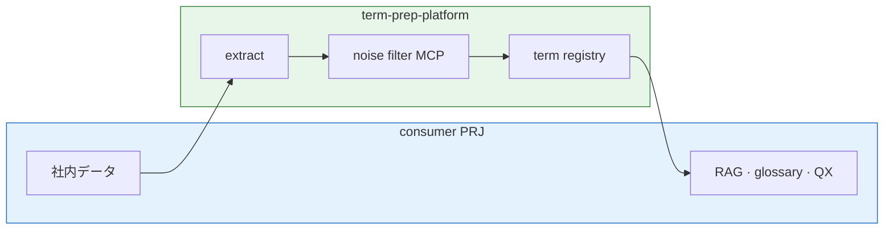

# Glossary Pipeline — 移植パッケージ

Project:
term-prep-platform

Repository:
https://github.com/wombat2006/term-prep-platform

Status:
Portable scaffold — **canonical home** for glossary-pipeline governance

---

## 目的

用語抽出パイプラインの **問題・解決手段の案・採択** を、実装（Python）から分離して記録する。

- 本リポジトリだけでなく **他 PRJ・専門用語辞典 PRJ** へコピーして使う
- [TO-BE-PLATFORM.md](../TO-BE-PLATFORM.md) は方向性、**本ディレクトリは手段の検討ログ**

**platform 全体の提供範囲**（RAG 本体は consumer）: [README.md](../../README.md#この-prj-が提供するもの) · [ARCHITECTURE.md](../../docs/ARCHITECTURE.md)

### Prep Platform 上の位置



本ディレクトリが扱うのは主に **extract · noise filter（Knowledge Filter MCP）· registry 周辺** の governance（P-001–P-006）。PII / sanitize は [mcp/](../../mcp/README.md) 側、RAG / 辞書 / query expander は consumer 側。

---

## ディレクトリ構成

```text
meta/glossary-pipeline/
  README.md              … 本ファイル（移植手順）
  PROBLEMS.md            … 問題一覧（P-xxx）
  OPTIONS.md             … 手段案インデックス + サマリ
  DECISIONS.md           … 採択ログ（D-xxx）
  options/               … 手段案の詳細（O-xxx.md）
  mcp/                   … Knowledge Filter MCP 仕様（portable）
  glossary-config.template.json

meta/contracts/            … Plan B contract canon（domain/surface/SPI）
  README.md
  http/openapi.yaml
  sse/event-envelope.schema.json

meta/schemas/              … glossary-config JSON Schema（CLI 起動時検証）
  README.md
  glossary-config.schema.json

mcp/                     … MCP implementations（platform ルート）
  glossary-knowledge/
  term-extract/ …
```

```text
scripts/
  glossary_extractor.py  … CLI 入口（別途コピー）
  README.md              … セットアップ
requirements-dev.txt     … fugashi + unidic-lite + jsonschema
```

---

## 他 PRJ への移植

### 最小セット（検討スペースのみ）

```bash
cp -r meta/glossary-pipeline /path/to/other-project/meta/
```

`PROBLEMS.md` / `OPTIONS.md` を PRJ 用に編集。Problem ID は PRJ 内で独立。

### 抽出ツール込み（推奨）

```bash
#  governance
cp -r meta/glossary-pipeline /path/to/other-project/meta/
cp meta/glossary-config.template.json /path/to/other-project/meta/glossary-config.json

#  tooling
cp scripts/glossary_extractor.py /path/to/other-project/scripts/
cp -r meta/schemas /path/to/other-project/meta/
cp requirements-dev.txt /path/to/other-project/   # または追記（jsonschema 含む）

#  optional
cp meta/TO-BE-PLATFORM.md /path/to/other-project/meta/
```

移植後:

1. `glossary-config.json` の `corpus.files` をその PRJ の Markdown に合わせる
2. **`python scripts/glossary_extractor.py --check --config …` で schema + 形態素を確認**
3. `PROBLEMS.md` に PRJ 固有の問題を追加
4. `options/` に手段案を書き、採択したら `DECISIONS.md` へ

**注意:** `glossary_extractor.py` だけコピーして schema / `jsonschema` を忘れると、起動時に `Config schema error` または ImportError になる。[meta/schemas/README.md](../schemas/README.md) 参照。

---

## ワークフロー

```text
問題が発生 / 限界が見える
    ↓
PROBLEMS.md に P-xxx 追加
    ↓
options/O-xxx.md に手段案を列記（複数可）
    ↓
OPTIONS.md インデックス更新
    ↓
採択 → DECISIONS.md（D-xxx）+ TO-BE / config / 実装
    ↓
不採択案は options/ に残す（Traceability）
```

---

## 命名規則

| 種別 | 形式 | 例 |
|---|---|---|
| 問題 | `P-{NNN}` | P-001 |
| 手段案 | `O-{PNNN}-{NNN}` | O-P001-001 |
| 採択 | `D-{NNN}` | D-001 |

手段案ファイル: `options/O-P001-001-output-split.md`

---

## 関連

- [TO-BE-PLATFORM.md](../TO-BE-PLATFORM.md) — 技術 TO-BE・Phase ロードマップ
- [meta/schemas/README.md](../schemas/README.md) — config JSON Schema・検証注意点
- [glossary-config.json](../glossary-config.json) — 本 PRJ の実行時設定
- [scripts/README.md](../../scripts/README.md) — fugashi セットアップ

---

## 索引

| 問題 | タイトル | 手段案数 |
|---|---|---|
| [P-001](PROBLEMS.md#p-001) | 出力 JSON の肥大化 | [OPTIONS.md](OPTIONS.md#p-001) |
| [P-002](PROBLEMS.md#p-002) | 開世界抽出によるノイズ | [OPTIONS.md](OPTIONS.md#p-002) |
| [P-003](PROBLEMS.md#p-003) | 用途 A/B の混在 | [OPTIONS.md](OPTIONS.md#p-003) |
| [P-004](PROBLEMS.md#p-004) | CLI とロジックの同居 | [OPTIONS.md](OPTIONS.md#p-004) |
| [P-005](PROBLEMS.md#p-005) | RAG 前処理未対応 | [OPTIONS.md](OPTIONS.md#p-005) |
| [P-006](PROBLEMS.md#p-006) | 複合語・英日ペア未統合 | [OPTIONS.md](OPTIONS.md#p-006) |
| [P-007](PROBLEMS.md#p-007) | 外部 corpus fetch の分散 | [OPTIONS.md](OPTIONS.md#p-007) |
| [P-008](PROBLEMS.md#p-008) | RAG Vector 投入の共通化 | [OPTIONS.md](OPTIONS.md#p-008) |

採択済み: [DECISIONS.md](DECISIONS.md) — [D-002](DECISIONS.md#d-002) Knowledge Filter MCP（stub、closed）・[D-005](DECISIONS.md#d-005) Plan B contract-first canon

Research Log: [RL-20260621-knowledge-filter-mcp](../../research-log/RL-20260621-knowledge-filter-mcp.md) — **Closed**

Implementation: [mcp/glossary-knowledge/](../../mcp/glossary-knowledge/README.md)

Consumers: [projects/](../../projects/)
