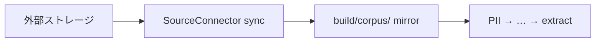

# O-P007-001 — Platform 薄型 SourceConnector

Problem:
[P-007](../PROBLEMS.md#p-007)

Status:
proposed

---

## 概要

外部ストレージ（S3 · GCS · Google Drive 等）から **prep 用 corpus のローカル mirror** だけを取る薄い層を platform に置く。出力は常にローカルパス — 既存 `corpus.files` と `glossary_extractor` をそのまま使う。



## メリット

- consumer ごとの fetch 重複を減らせる
- prep パイプラインの入口を「mirror → PII → …」と一貫して説明できる
- MCP / CLI どちらでも同じ contract を共有できる

## デメリット

- OAuth · 差分同期 · レート制限は prep より重い — スコープ管理が要る
- techdev-cursor の TS コネクタと役割が重なりうる

## スコープ制約（採択時の条件）

| やる | やらない |
|---|---|
| list · fetch · sync_to_local | repo 内 API key |
| `source` config + env 認証 | — |
| mirror 後は既存 prep のみ | — |

**Google Drive:** 新規 Python SDK 実装は書かず [O-P007-004](O-P007-004-googledrive-connector-reuse.md)（techdev-cursor `googledrive-connector.ts` 流用）を正とする。

**RAG Vector:** prep 本体（Python）の外 — [O-P008-001](O-P008-001-rag-vector-connector.md) で同一 TS connector の `vector` モードとして Phase 4.5 検討。

## config 案（draft）

```json
{
  "source": {
    "enabled": false,
    "adapter": "s3",
    "local_mirror": "build/corpus/sync",
    "s3": {
      "bucket": "example-corpus",
      "prefix": "docs/",
      "region": "ap-northeast-1"
    }
  },
  "corpus": {
    "files": ["build/corpus/sync/**/*.md"]
  }
}
```

## 配置案

| 段 | パス |
|---|---|
| contract | `scripts/connectors/base.py` |
| CLI | `scripts/sync_corpus.py` |
| MCP（任意） | `mcp/source-sync/` |
| schema | `meta/schemas/glossary-config.schema.json` |

## 関連 Phase

TO-BE **Phase 0.5**
