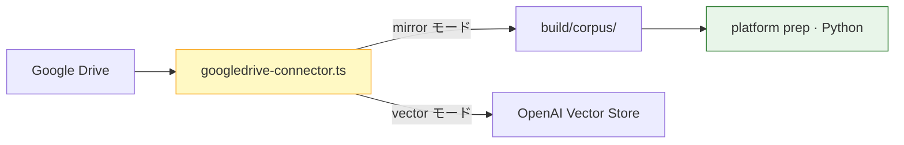

# O-P007-004 — Google Drive: googledrive-connector.ts 流用

Problem:
[P-007](../PROBLEMS.md#p-007)

Status:
proposed — **推奨方針（2026-06-21）**

Related:
[techdev-cursor `googledrive-connector.ts`](https://github.com/wombat2006/techdev-cursor/blob/master/src/services/googledrive-connector.ts)

---

## 概要

Google Drive 向け fetch / sync は **新規 Python 実装を書かず**、techdev-cursor 既存 [`googledrive-connector.ts`](https://github.com/wombat2006/techdev-cursor/blob/master/src/services/googledrive-connector.ts) を **platform へ移管・共通化して流用** する。

## なぜ流用か

| 理由 | 内容 |
|---|---|
| 実績 | OAuth · Drive API · 差分 sync · Vector 投入が既に TS で存在 |
| 重複回避 | platform 側で Drive SDK を二重実装しない |
| 一貫性 | techdev-cursor Phase 4「RAG prep hook」と同じコードベースで繋げられる |

## 配置案

| 段 | パス | 備考 |
|---|---|---|
|  canonical | `connectors/googledrive/`（platform） | techdev-cursor から extract / 移管 |
| consumer | `src/services/googledrive-connector.ts` | **薄い re-export** または deprecation 期間後に削除 |
| 呼び出し | `npm run connector:drive-sync` / Node subprocess | Python prep からは mirror パスだけ受け取る |

## モード分離（同一 connector · 2 出口）

| モード | 出力 | 用途 |
|---|---|---|
| `mirror` | ローカル `build/corpus/` | glossary prep · `corpus.files` |
| `vector` | OpenAI Vector Store | RAG 索引 — [O-P008-001](O-P008-001-rag-vector-connector.md) |

**prep パイプライン（Python）と Vector 投入（TS）の責務は分ける**が、**Drive 接続コードは 1 本**に統一する。

## 移行ステップ（draft）

1. platform に `connectors/googledrive/` を作成し、techdev-cursor からコピー + 依存を最小化
2. `mirror` API を追加（Vector 非経由でファイルだけ落とす）
3. techdev-cursor は platform パッケージを参照（sibling path または npm workspace）
4. consumer integration doc を更新

## 関連 Phase

TO-BE **Phase 0.5-3**（Drive）· **Phase 4.5**（Vector モード）
