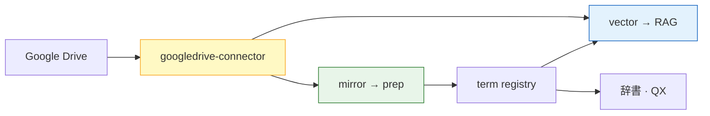

# O-P008-001 — Platform が RAG Vector connector も提供

Problem:
[P-008](../PROBLEMS.md#p-008)

Status:
proposed

Related:
[O-P007-004](O-P007-004-googledrive-connector-reuse.md)

---

## 概要

**Outputs 側の RAG Vector 投入**も platform が共通化する案。Drive 接続は [googledrive-connector.ts 流用](O-P007-004-googledrive-connector-reuse.md) の **`vector` モード**として同じモジュールに載せる。

## メリット

- 利用側 repo が「fetch · prep · Vector」の 3 点バラバラ実装しなくてよい
- techdev-cursor 既存 RAG ルートを platform 公式パスに昇格できる
- mirror → prep → vector を **1 config チェーン**で説明しやすい

## デメリット · リスク

| リスク | 対策 |
|---|---|
| platform スコープ拡大 | Phase 4.5 として明示 · Python prep とは別パッケージ |
| OpenAI 依存が platform に入る | adapter インタフェース + consumer env 認証 |
| dopagaki 等 Drive 非利用 consumer | Vector / Drive connector は **optional** — ローカル corpus のみも可 |

## 提供イメージ

| 提供物 | 説明 |
|---|---|
| `connectors/googledrive/` | mirror + vector モード |
| `connectors/vector/`（将来） | Vector Store 抽象 — OpenAI 以外も adapter 化 |
| config `outputs.rag` | vector_store_id · folder_id · post_prep hook |

## 採択条件

- O-P007-004（Drive 流用）が先に着地していること
- prep 完了後に vector sync を呼ぶ hook contract が決まっていること

## 関連 Phase

TO-BE **Phase 4.5**（RAG Vector connector — 提案）
