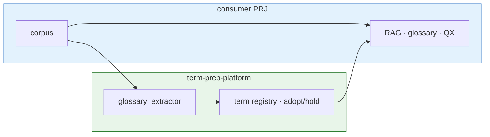

# Scripts

Project:
term-prep-platform

---

## Position in target flow

`glossary_extractor.py` は Prep Platform の **extract → noise filter → term registry** 区間の CLI 入口。PII / sanitize は upstream MCP、RAG / 辞書 / query expander は **consumer が保持**。



提供範囲: [docs/ARCHITECTURE.md](../docs/ARCHITECTURE.md) · [README.md](../README.md#この-prj-が提供するもの)

---

## Setup

```bash
source .venv/bin/activate
python -m pip install -r requirements-dev.txt
python -m pip install -r requirements-mcp.txt
```

**System:** MeCab (`libmecab`)

| OS | Command |
|---|---|
| AlmaLinux / RHEL 9 | `sudo dnf install mecab`（`mecab-devel` は **不要** — AppStream に無い） |
| Debian/Ubuntu | `sudo apt install mecab libmecab-dev` |
| macOS | `brew install mecab` |

**Python:** 必ず repo ルートの `.venv` を activate してから CLI を実行する。システム Python にだけ `jsonschema` 等を入れても、`.venv/bin/python` 実行時には効かない。

---

## glossary_extractor.py

Extract glossary candidates from Markdown using **fugashi + unidic-lite**.

```bash
# Package contract (recommended)
term-prep-extract --check --config /path/to/consumer/meta/glossary-config.json

term-prep-extract --config /path/to/consumer/meta/glossary-config.json

# Direct script (platform development only)
python scripts/glossary_extractor.py --check --config projects/dopagaki-transition/glossary-config.json
```

**Governance:** [meta/glossary-pipeline/](../meta/glossary-pipeline/README.md)  
**Roadmap:** [meta/TO-BE-PLATFORM.md](../meta/TO-BE-PLATFORM.md)  
**Config schema:** [meta/schemas/README.md](../meta/schemas/README.md)

Exit codes: `0` success · `1` config / IO / **JSON Schema 不一致** · `2` morphology unavailable

### Config 検証（注意）

- `load_config()` が [meta/schemas/glossary-config.schema.json](../meta/schemas/glossary-config.schema.json) で検証する。**`--check` も本番も同じ**
- 依存: `jsonschema>=4.23.0`（`requirements-dev.txt`）
- スキーマエラー例: `output` をオブジェクトにしたが `adopt` 欠落、`filter` に typo キー、semver 以外の `version`
- **legacy:** `output` を文字列 1 本にした旧形式もスキーマ上は許容（Phase 0 移行済み PRJ ではオブジェクト推奨）
- **`project_root`:** `--config` パスの親から解決。実行時 CWD は repo ルート想定だが、パス解決の基準は config ファイル側
- **`filter.emit_reject`:** デフォルト `false` — `true` にしない限り reject JSONL は書かない（Git 衛生）

---

## sync_corpus.py (Phase 0.5)

Sync external corpus into consumer `project_root` before extract. Google Drive uses [connectors/googledrive](../connectors/googledrive/).

```bash
cd connectors/googledrive && npm install && npm run build
export GOOGLE_CLIENT_ID=... GOOGLE_CLIENT_SECRET=... GOOGLE_REFRESH_TOKEN=...

# No-credential checks (schema, globs, credential guards):
bash scripts/run_phase05_checks.sh

term-prep-sync --check --config /path/to/consumer/meta/glossary-config.json
term-prep-sync --config /path/to/consumer/meta/glossary-config.json  # needs OAuth — deferred
```

Requires `source.enabled: true` and `source.googledrive.folder_id` in glossary-config.  
`corpus.files` may use globs (e.g. `build/corpus/drive/**/*.md`).

---

## File roles

| File | Role |
|---|---|
| `scripts/glossary_extractor.py` | Shared extraction CLI |
| `scripts/sync_corpus.py` | Drive/S3 mirror CLI (Phase 0.5) |
| `scripts/connectors/` | Source connector adapters |
| `connectors/googledrive/` | Google Drive mirror (TypeScript) |
| `meta/schemas/glossary-config.schema.json` | Config JSON Schema (validated on load) |
| `meta/glossary-config.json` (consumer) | Consumer-side runtime config |
| `build/glossary/` | Generated adopt/hold/reject (Git ignored) |
